# XComponent User Guide

## Contents

* [1 - Overview](#1---overview)
* [2 - XComponent philosophy](#2---xcomponent-philosophy)
  * [Microservice definition](#microservice-definition)
  * [Component definition](#component-definition)
  * [State machine definition](#state-machine-definition)
  * [State definition](#state-definition)
  * [Transition definition](#transition-definition)
  * [Event definition](#event-definition)
  * [Triggered method](#triggered-method)
  * [Triggering rules](#triggering-rules)
  * [API](#api)
  * [Composition](#composition)
* [3 - XCStudio](#3---xcstudio)
  * [XCStudio menus](#xcstudio-menus)
  * [Top menu icon bar](#top-menu-icon-bar)
  * [XCStudio project hierarchy](#xcstudio-project-hierarchy)
  * [Creating a new project](#creating-a-new-project)
  * [Navigate within your project](#navigate-within-your-project)
  * [Creating a new component](#creating-a-new-component)
  * [Designing state machines using XCStudio](#designing-state-machines-using-xcstudio)
  * [State machine in depth](#state-machine-in-depth)
  * [Deleting parts of your components](#deleting-parts-of-your-components)
  * [Creating a component data structure](#creating-a-component-data-structure)
  * [States in depth](#states-in-depth)
  * [Transition in depth](#transition-in-depth)
  * [Timeout transitions](#timeout-transitions)
  * [Internal transitions](#internal-transitions)
  * [Triggerable transition](#triggerable-transitions)
  * [Customizing transitions](#customizing-transitions)
  * [Enabling Triggered method to implement your own code](#enabling-triggered-method-to-implement-your-own-code)
  * [Visual Studio generated project hierarchy](#visual-studio-generated-project-hierarchy)
  * [Implementing triggered methods](#implementing-triggered-methods)
  * [Composition](#composition)
  * [Microservices composition](#microservices-composition)
* [4 - Testing your project using XCSpy](#4---testing-your-project-using-xcspy)

## 1 - Overview

XComponent is an open platform to easily create, control and share microservices.
In XComponent, a microservice is a set of components. Each component is based on state machines.
This approach is powerful and flexible because it enables you to size or resize your microservices as you want.

XComponent provides the following tools:
* XCStudio: an application to design / compose components and microservices
* XCRuntime: an execution environment for xc microservices
* XCSpy: a test tool
* XComponent AC2 (not available yet in community edition): an application to deploy and control microservices
* XComponent Gallery: it enables you to share easily your projects

The following figure is a good summary of the XComponent architecture.

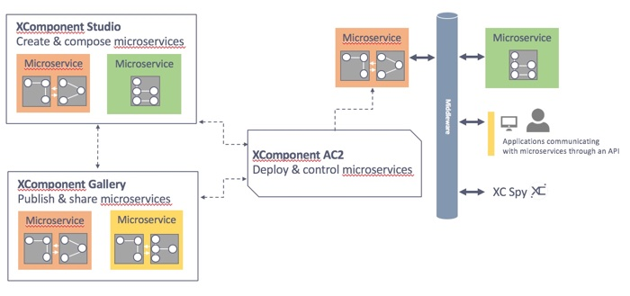

> Note: "Microservice architectural style is an approach to develop a single application as a suite of small services, each running in its own process and communicating with lightweight mechanisms. These services are built around business capabilities and independently deployable by fully automated deployment machinery.” *James Lewis & Martin Fowler*

# 2 - XComponent philosophy

XComponent is based on state machine diagrams. To design, implement and build your projects you’re going to use XCStudio and Visual Studio. 
XCStudio is an IDE to create microservices. 

The aim of this chapter is to provide you few definitions of the concepts related to XComponent including:
* a microservice
* a component
* a state machine
* a state
* a transition
* an event
* a triggered method
* a triggering rule
* an api
* a composition

### Microservice definition

> "Microservice architectural style is an approach to developing a single application as a suite of small units, each running in its own process and communicating with lightweight mechanisms" *Martin Fowler*

XComponent defines a microservice as a set of components. It leads to much more flexibility:
Indeed, you can begin with a monolith, and then split your architecture into microservices.

XComponent proposes to embrace the microservice style:
* Split each feature in a separate service
* Easy evolution, refactoring and scaling / accelerate innovation
* Single responsibility pattern (business oriented service) 
* Decoupled your microservices (Tolerant Reader Pattern for example)

This approach promotes the idea of "design for failure".
It means that your application has to tolerate service failures. For example, you can use circuit breakers and timeout patterns.

### Component definition

In XComponent, a component is a logical brick answering a functional need. It’s an aggregation of several state machines, each state machine made of several states linked to each other by transitions.

### State machine definition

The definition of a state machine is similar to a class in Object-Oriented Programming. It can be instantiated several times exactly as a class can be. A class instance is an object and in XComponent we call it a state machine instance. 
In XCStudio a state machine is a set of states, a state machine is delimited by a blue edge.

### State definition

A state is the current status of a state machine instance.
A state is represented by a colored circle in XCStudio.

### Transition definition

A transition is the only way to go from a state to another. A transition can be triggered by an event called a triggering event which is represented by a C# class. 
For instance let’s consider two states: StateA and StateB are linked by a transition: Trans1, triggered by event: EventX.
If we’re in StateA and EventX is received, the status changes from StateA to StateB.
Transitions are represented in XCStudio by arrows.
Below the scheme of previous example:


### Event definition

An event is an object that triggers a transition. When an event is received by a machine instance, it triggers a transition.

### Triggered method

This is the method called once the transition is activated in which you can do whatever you want. The developer codes the triggered method in C#, Java, C++, Javascript ...

### Triggering rules

Triggering rules have been set up to implement, if needed, tests before launching transition to make sure that when an event is received, we can change the state of the state machine instance.
You can check if data matches other, contains elements or implement specific rules using Visual studio.
If one test is not ok the transition is not launched and the current state doesn’t change.

### API

A client API defines the contract between external applications and components, in other words what you’re going to be able to do with the user applications. 
Example of user application can be generated using XC Studio (WPF or Console applications).

### Composition

The default composition view enables you to manage the dependencies (or links) between components and APIs.
It means that this view contains the definition of all the communication links between components and APIs.
* The link source is the component or API output.
* The link target is the component or API input.

The following figure shows a composition example:

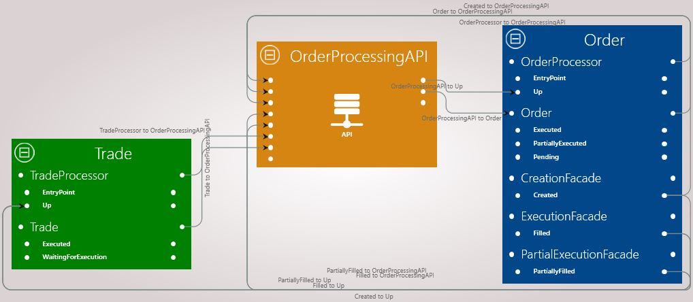

The microservices composition view contains the definition of each microservice. Microservices composition example:

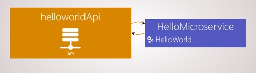


## 3 - XCStudio

XCStudio lets you:
- Design components
- Create API and microservices
- Configure environments
- Use Visual Studio to edit specific rules for your components.

The following part briefly describes XCStudio menus to give you an overview of how to use this application.

### XCStudio menus

You navigate through 4 menus and a context menu:

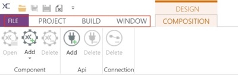

The five top menus lets you control views and preferences of the project:
- File menu: to create, open, save XComponent project, configure XCStudio and set user settings
- Project: a global view of your XComponent project where you can edit your project settings, export and run your application.
- Build menu: to build a component or the entire project
- Window menu: to edit display preferences.

The context menu depends on the selected window. In the previous screenshot, It provides tools to design your components and to customize your composition.

### Top menu icon bar

Around XComponent logo (in the top left hand corner) there’s a quick launch icon bar gathering the most used actions:

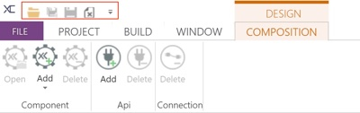

From left to right these shortcuts are:
- Open project (Ctrl + O)
- Save current project (Ctrl + Maj + S)
- Save current document (Ctrl + S)
- Undo (Ctrl + Z)
- Redo (Ctrl + Y)
- Close current project (Ctrl + W)

### XCStudio project hierarchy

XCStudio projects are stored in *.xcml files.

Default XCStudio projects directory is “C:\XComponentProjects\{projectNameYouHaveChosen}\”
Here below is the generated project hierarchy:

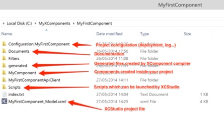

When creating a new project you can change the default location.

Other files can be stored in project directory, for instance if you generate GUI applications, by default location proposed by XCStudio is the same directory.

### Creating a new project

Start XCStudio and click on the *File* menu and select the new item. The following window is displayed:

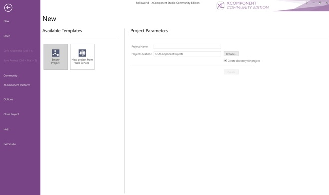

Enter project name: for instance MyFirstMicroservice.

The project window appears, you will be able to add components and api. You can see that an API called MyFirstMicroserviceApi has already been created by default.


### Navigate within your project

The explorer panel gives you an entire view of your project. 

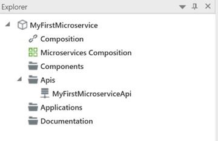

It contains:
- A shortcut to your linking
- The composition
- The components
- The views
- The APIs
- The GUI applications
- Your project documentation

### Creating a new component

To add a new component, just use the context menu in the explorer panel:

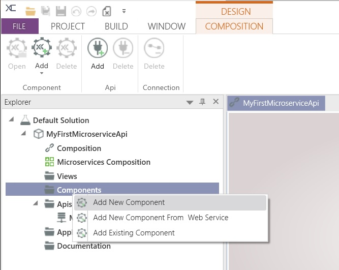

The application switches automatically to the component menu and leaves you to a space where you can edit component.

> Note that there is already a state machine on this window. It’s the entry point and cannot be removed. The entry point is the first state created by the XComponent Runtime.

This is what you have on the screen in standard profile hiding properties error and console.

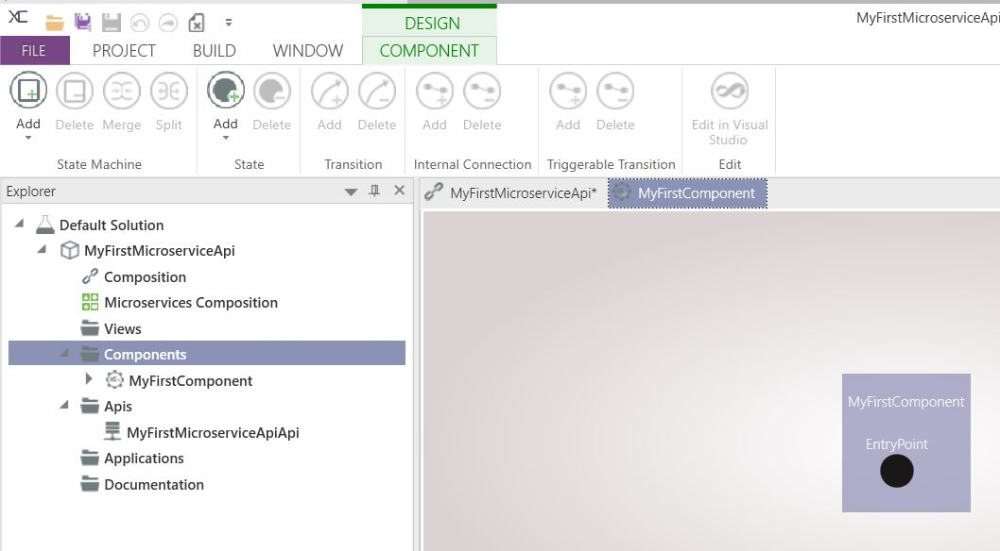

### Designing state machines using XCStudio

To add a new state machine in your component, just click on the add button as shown in the next figure.
 
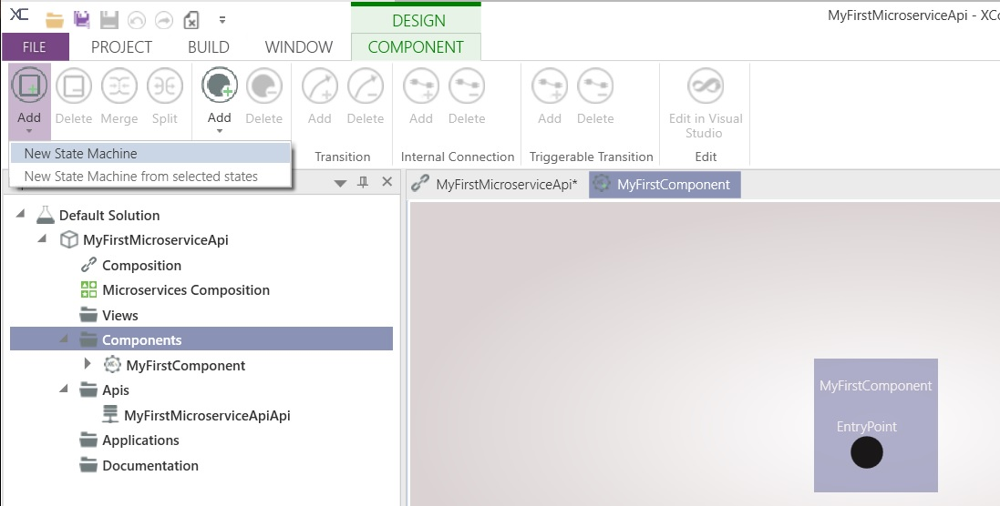

There is a second way to do this: let CTRL pressed while double clicking on the white wide empty zone. This action creates a state. If you’re not double clicking inside a state machine, creating this state also creates a state machine.

> Note: you can add a transition different ways:
> * select two states and use the add button (ribbon)
> * select a state and drag the blue circle to another state…

Follow these instructions to create a simple state machine with 2 states and 1 transition:
- Add a new state machine
- *StateMachine2* appears. Double click on *StateMachine2* text to rename it to “FrontOffice”.
- Click on *State2* a blue circle appears to show you that the selection is on the *State2* state and click on  and *new State form the selected states*
- Drag *State3* to somewhere else in order to be able to read *Transaction1* on the arrow
- Double click on *State2* text to rename it to *Pending*
- Double click on *State3* text to rename it to *Validated*
- Double click on *Transition1* text to rename it to “ValidateFrontOffice”
- Add a transition between EntryPoint and Pending
- Rename the transition to *SendToFrontOffice*
- Rename *StateMachine1* to *Entry*

The component looks like this:

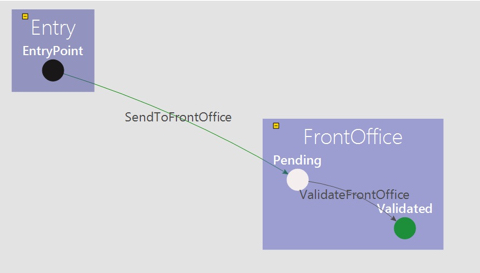

> It is important to notice that each time you arrive on a state machine from another, a new instance of state machine is created.

Save your component: File + Save or Crtl+S.
Notice that you can save the project by using the Maj+Ctrl+S shortcut

### State machine in depth

Two objects can be attributed to a state machine:
- Internal member: a class you define in which are stored information that don’t need to be exposed on the network
- Public member: a class you define in which are store information that need to be exposed on the network

If you click on a state machine name, the properties panel displays details about the selected state machine.

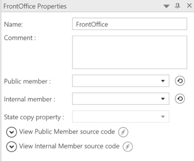

### Deleting parts of your components

You can delete API, components, state machines, states and transitions, except the first state machine that contains the EntryPoint.

To do this you simply need to click on the object you want to remove, and click on the following buttons:
- 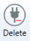 to delete an API
- 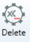 to remove a component
- 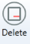 to delete a state machine
- 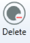 to delete a state
-  to delete a transition

Another way to do this is to press the DEL key when you have selected one or more entities that can be deleted.

### Creating a component data structure

XComponent is an event-driven platform. It means that:
- you can send events to components to trigger transitions
- you will receive event notifications from state machines

> Note: An event is defined as a C# class
  
In order to be functional, a component needs a class (representing an event type) for each transition.

> Note: If you want to use an internal transition you’re have to set a public/internal member (classes for state machine representing shared data between all states of the current state machine; public member can be accessed by everyone while internal not).

This is the way to exchange/save information: adding classes to state machines and transitions:
- On a state machine it represents the public or internal member which is a C# class. All states belonging to this state machine have access to it,
- On a transition it’s also a C# class that contains what you want to send to the destination state.

To add a class, first click on the element you want to add a class to and then go to the Add new class panel. Please note that the *Add new class* window is activated in the Windows menu.

For instance click on the “Entry” state machine and go to the *Add new class* panel.

On the right pane, you can define properties using the table to store data such as text (string), integers/float values (int/double), or other types of data, in the class you want to add and attach to a transition or a public/internal member.

The class name is already set to *Entry*, we don’t need any property so we just need to click on “Add and set”. “Add and set” allows you to add a new class and assign it to the current object selected; this action also generates C# code of this class.

Now we need to add classes to all transitions and state machines.

> Note: instead of using the class generator, you can import your own dll. 

### States in depth

You may have notice that circles representing states in XCStudio can have various colors.

Here’s the meaning of the colors:
- Black is reserved for *EntryPoint* states
- White is for non-ending states
- Green is used to indicate ending states inside a state machine

In the property panel, you can specify a comment on a state.

If you click on a state you can write a personal comment on it in the text area:

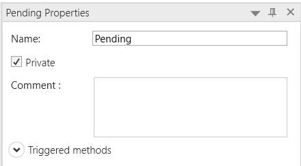

> Note: Comments are used to generate your project documentation.

### Transition in depth

Several transitions exist. Two transition types are commonly used: 
- Regular transition between two states in the same state machine
- Transition between two states from different states machine. 
The first one is gray (color can be customized) and ran in the same instance of the current state machine while the second one is green (also customizable) but, it creates a new instance of the state machine pointed by the arrow of the transition. 
You can also add a comment on a transition.

To create a comment: click on a transition, fill the comment text area (property panel).

### Timeout transitions

Timed out transitions are transitions that are automatically triggered once when the time is elapsed. Time out transitions can only be implemented between two states in a single state machine.
To add a new timed out transition, click on the transition you created, check the property:
 and set the delay after which the transition will be triggered automatically. Numbers before comma represents second, so you have a millisecond precision.

### Internal transitions

An internal transition is a way to launch a transition which does not change the current state of the state machine. For instance let’s consider the following example:

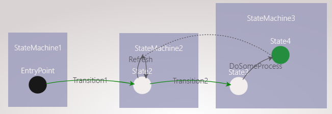

Once arrived on “State4”, transition refresh on “State2” can be launched.
Internal transitions have a particularity: the event sent by “State4” is necessarily the type of its public member, in this case “StateMachine3”. So the class set to refresh should be the type of “StateMachine3”.
To draw them you can select a state then select the blue circle surrounding. You can also select both the state and the transition (letting CTRL pushed to select both with the mouse) and click on the button:
 in the menu internal connections.

### Triggerable transitions

Triggerable transitions work the same as internal transitions but you use a different type of event to launch the transition.

> *Triggerable transitions* enable you to trigger transition from your code (see triggered methods chapter)

To draw them you can select a state then select the blue circle surrounding and drag from the state to the target transition. In the property panel, the following options are available:


Click on Triggerable transition. You can also select both the state and the transition (letting CTRL pressed to select both with the mouse) and click on the button
in the menu triggerable connections.

### Customizing transitions

You have the possibility to add some checks on transitions. On XCStudio in transition properties window you can:
- Add matching keys
- Add specific rules
Following options can be set on the properties of a transition.  Click on a transition.

Now you can navigate and add this key using this window:

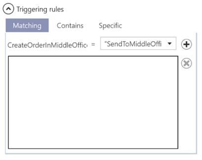

Choose the right tab menu, select corresponding items and click on “Add” button to validate creation.

Matching Key compares a “Public Member” property with a “Triggering Event” property. If it’s not a match, transition will not be triggered.

Contains Key option searches the current state machine class if it contains a triggering event class member. If this class member is not in the list, transition will not be triggered.

If you want to do more specific checks, click on “Specific” tab and tick use specific rule. When you click on the build button on the component menu, this will generate the skeleton of C# methods in which you’ll have access to everything you need to make some tests. In following parts will be described the Visual Studio Project Hierarchy.

### Enabling Triggered method to implement your own code

#### Triggered method types 

Two types of triggered methods exist. The first one is a triggered method. This code is executed when arriving on a state from a precise transition. To enable this possibility of implementing your own code (by default it’s *None*) you have to go to the state properties clicking on a state and choose to write specific code in C# (selecting *Native C#*) or any other language (selecting *Rest Worker*).

The second type is called Initialize PublicMember: before arriving on a state machine you can perform actions, and when you arrive from a specific transition you can perform specific actions.
What’s important to understand is that the initialize part is executed before arriving on the state.

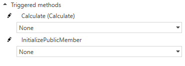   

#### REST Service configuration

These two types of triggered methods could be coded in several programming languages (Java, C++, Javascript ...) other than C#. To do so *Rest Worker* should be selected; this option sets REST service(s) through which the triggered methods are executed.


To configure REST service(s), service(s) URL should be precised in the project configuration.

So first, we have to open Properties window.

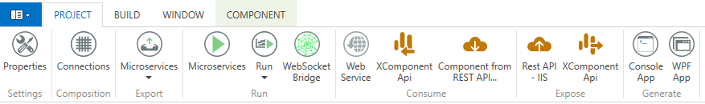 

If we want to set a REST service per runtime, in "Components" window when a server mode is selected, a Function Manager Service URL should be entered.

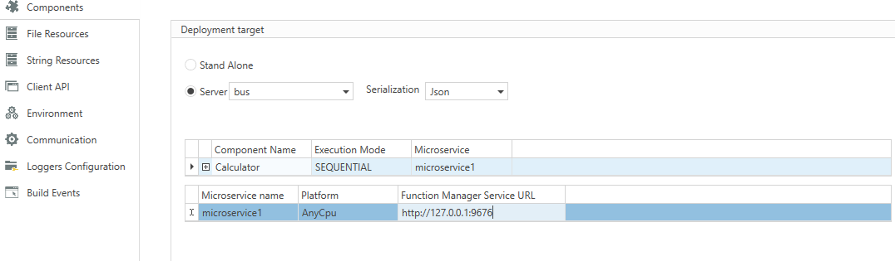 

If we want to a set a REST service per state machine, in "String Ressources" window, select the component containing the state machine and enter the state machine name followed by *_FunctionManagerServiceUrl* as key and the service URL as value.


### Visual Studio generated project hierarchy

When you create your project in XCStudio, XCStudio application generates data in file, for instance, xcml file is the global file containing and including all the rest.
When you create a new component you have a new directory created by the Studio in your workspace directory (by default: *C:\XComponentProjects\{MyProjectName}\*)
Each time you add and set a class on state machine it creates a C# class in the component.
When clicking on add and set a new class on a transition, it has the same effect.
If you click on a state and check triggered methods to activate them, XCStudio generates C# code in a specific class.

To visualize what has been generated in Visual Studio project click on
 to open Visual Studio.

You get a window that looks like the following figure:

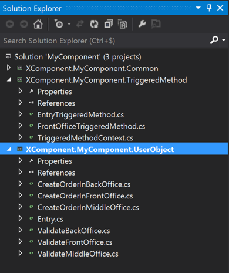

You can see that in the Visual Studio solution, three projects exist: 
- Common: containing class reused by other visual studio projects and xcomponent core. 
- TriggeredMethod: one by state machine when you enable triggered method or specific rules. Pattern for triggered method class file generated is named like this: {StateMachineName}TriggeredMethod.cs, while specific rules class file is named like: {StateMachineName}UserSpecificRules.cs.
- UserObject: all objects added from the XCStudio interface: triggering events, public members, internal members.

#### Implementing triggered methods

> Please note that the initialize method skeleton is generated in the state machine file from which transition is leaving and not the state machine it’s arriving to.

Examples of triggered methods:

- C#
```cs
public static void ExecuteOn_Pending_Through_SendToFrontOffice(XComponent.MyFirstComponent.UserObject.SendToFrontOffice sendToFrontOffice, XComponent.MyFirstComponent.UserObject.FrontOffice frontOffice, object object_InternalMember, Context context, ISendToFrontOfficeSendToFrontOfficeOnPendingFrontOfficeSenderInterface sender)
{
    throw new NotImplementedException();
}
```
- Javascript
```js
getTask(getOptions('/api/Functions?componentName=Calculator&stateMachineName=CalculatorManager'), function(err, taskObj)
    {
        if( taskObj != null)
        {
            var jsonResponse;
            if( taskObj.FunctionName === "ExecuteOn_EntryPoint")
            {
               jsonResponse = {
                   "ComponentName":taskObj.ComponentName,
                   "StateMachineName":taskObj.StateMachineName,
                   "Senders" :  
                    [
                        {
                            "SenderName" : "Init",
                        }
                    ],
                   "RequestId":taskObj.RequestId
               };

               postResult(postOptions, JSON.stringify(jsonResponse));
            }
            else
            {
                console.error("Unknown task : ", taskObj);
            }
       }
   });
```

In a triggered method, you can:
- have access to the public member of your state machine and the event that triggered the transition
- Update your public member
- Interact with other state machines by using the sender object
- Interact with third-party libraries


### Composition

APIs will be used to define whose component/API a component/API is able to communicate with. 

Several APIs can be used but, in most cases you only need a single API. It’s not useful unless you want to separate data. For instance some data are critical or secured so you will use one API for this type of data and another one for the rest. 

White circles on the left of components/APIS represent the inputs and white circles on the right of components/APIs the outputs. If you link a state machine, all states belonging to this state machine are linked.

Example of composition:

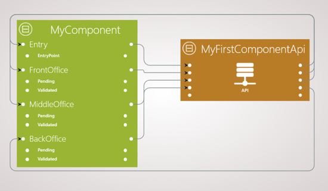

### Microservices composition

You can open the microservices composition view from your project explorer.

Example of microservices composition:

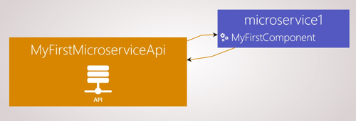

In this view, you can:
- have a quick view of your architecture
- rename your microservices
- move a component to another microservice

# 4 - Testing your project using XCSpy

XCStudio integrates a spy called XCSpy to run functional tests. This way you can validate your project and find eventual errors.

You first need to build your project and then run the spy.
Click on Start spy:  to launch the spy application.
Click on a component name (for example *MyComponent*) to display the component you want to test.

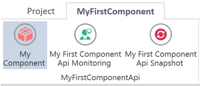

You got this window:

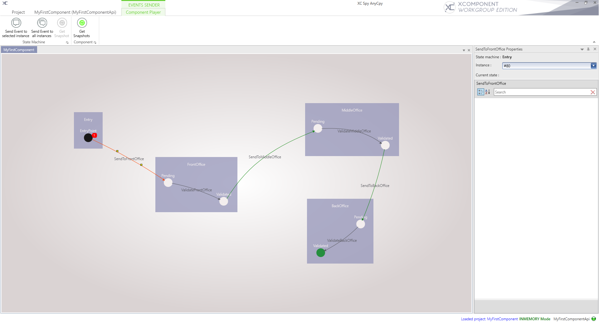

XCSpy allows you to test your component and validate its functional behavior by sending transitions/events.

The EntryPoint state has a red notification badge containing a number. It represents the number of instances of the state machine that currently are in this state.
When launching the spy for the first time, once you have clicked on your component the EntryPoint has 1 instance. This is the beginning of your component. From here you can start testing.

The Spy menu contains:
- A project menu. You can display the property panel by clicking on the *Show properties* button. This panel provides details about the selected element (state machine, state or transition)
- A list of project menu. The following figure shows details about this menu

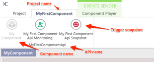

- A context menu used to interact with your component (send events)

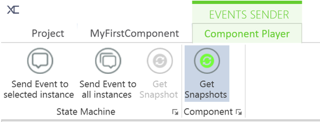

In the *Events sender* menu we can choose the way of sending an event: send an event to a selected instance or to all instances. The first one only affects the entity selected while the other one affects all entities in this state.

It is important to point out that you can send a default or a custom event. Default event is an empty class. Using customize events allows you to set to defines in the triggering event variables values.

Keeping in mind the following example, if we want to trigger the transition called *SendToFrontOffice*, click on the transition. Then fill the event values in the property panel.

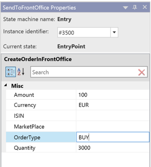

Click on the *Send event to the selected instance* button to send the custom event to the state machine instance selected in the property panel (example: instance identifier 3500).

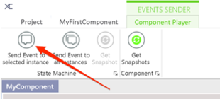

> It is important to notice that the EntryPoint state machine always has one instance!

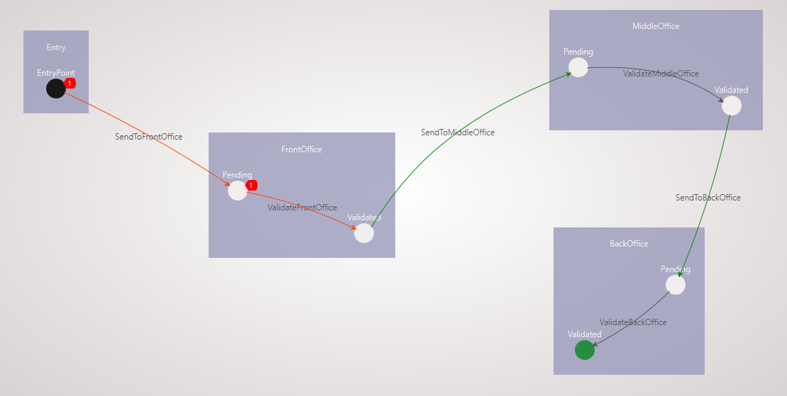

This creates a new instance of *FrontOffice* state machine and affects values to *FrontOffice* public member.
We can verify *FrontOffice* public member affectation. Click on *Pending* to display details in the property panel. 

Click again on the *EntryPoint* again and create another instance of *FrontOffice* state machine sending a new event.

Now you have two instances of *FrontOffice* state machine in *Pending State*.

Using XCSpy allows you to instantly test your project, your component, what you implement, without developing a User Interface, and without wasting time and money. 
