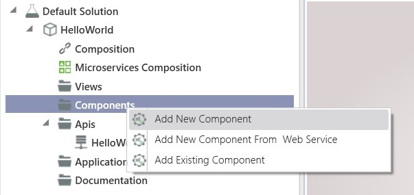
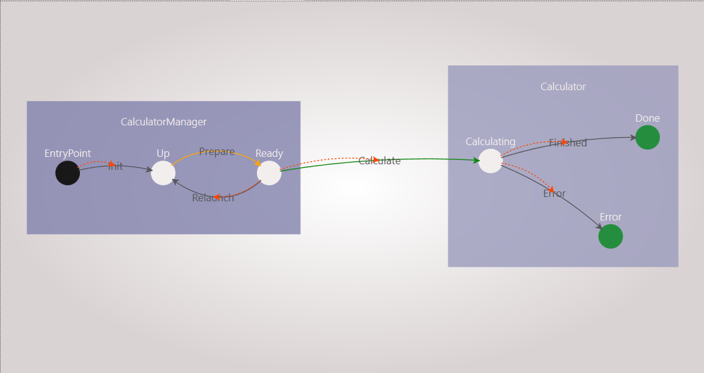
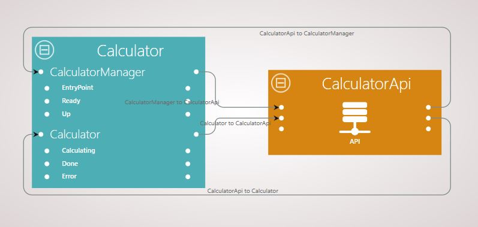
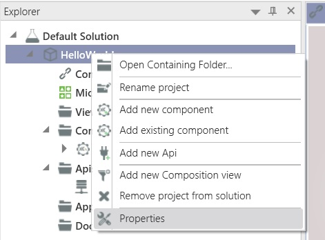
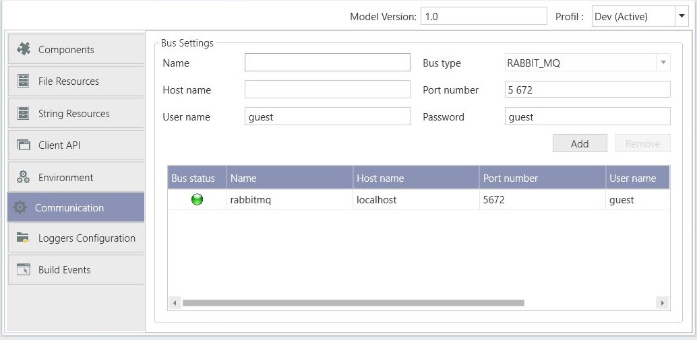
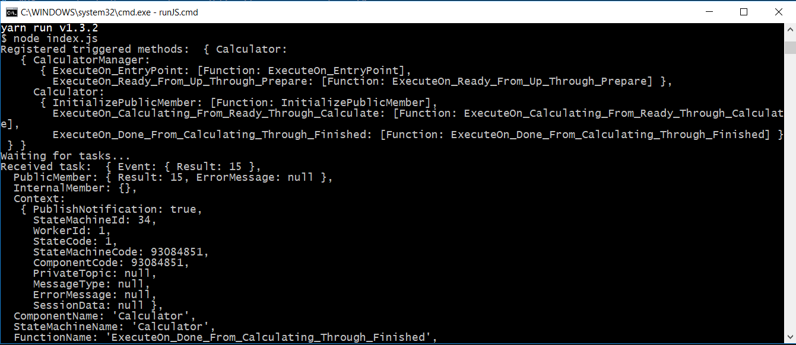

# Calculator: step by step tutorial

This document describes how to create a simple `Calculator` microservice with XComponent whose triggered methods are implemented in JavaScript instead of C#.

## Overview

XComponent is a platform to create, monitor and share microservices.

In the `Calculator` sample we are going to create two different pieces of software:
* **`[Calculator microservice]`** - A XComponent microservice that receives requests to calculate additions;
* **`[Calculator.js worker]`** - A simple NodeJS application to run triggered methods coded in JavaScript.

## Install XComponent Community

The easiest way to install the XComponent Community Edition is to download the latest version from [Nuget](https://www.nuget.org/packages/xcomponent.community/)

## Create your first microservice

### Create a new XComponent project

* Start XCStudio **`[packages\XComponent.Community\tools\XCStudio\XCStudio.exe]`**

* Create a new project named **`Calculator`**:

### Create your first component

* Create a new *component* named **`Calculator`**:



 * Create a *CalculatorManager* and a *Calculator* state machines  
 > Note : the *CalculatorManager* create instances of *Calculator* with two numbers as input, through *Calculate* transition. The *Calculator* state machine do operation(s) with the inputs.   

 You should end up with the following component:

 
  
  * On *Entry_Point*, *Ready*, *Calculating* and *Done* states triggered methods select *Rest Worker* so as they wont be generated in C# but will be implemented in any other language able to consume REST services. In the present example we will use JavaScript.

### Complete your composition view
 
* Go back to the composition view
* Add links between your component and the default api.
   
You should end up with the following figure:
   

  
> Note: In the composition view, on each component, inputs are the left side bullet points and component outputs are the right side bullet points.

### Configuration

* Open the properties window of your project (see following figure)



* Fill the RabbitMQ settings:

In the *Communication* section choose a name for the RabbitMQ bus and click on the *Add* button.
You should see your bus with a green indicator as in the following figure:



In the *Components* section change the deployment target from *Stand Alone* to *Server*.
In the drop down you should see the previously configured RabbitMQ bus.


## Test your microservice

* Build your solution (see following figure)


* Start your microservice (*Project* menu + *Run* sub menu + *Microservices* button and then the *Start* button)
* Create a NodeJS application to implement your triggered methods
* Add the `xcfunctions.js` library to your project with the following command:
```
$ npm add xcfunctions
```

* Copy/Paste the following code in your *index.js*

```js
const xcfunctions = require('xcfunctions');

xcfunctions.registerTriggeredMethods('Calculator', 'CalculatorManager', {
    ExecuteOn_EntryPoint: (event, publicMember, internalMember, context, sender) => {
        sender.Init();
    },

    ExecuteOn_Ready_From_Up_Through_Prepare: (event, publicMember, internalMember, context, sender) => {
        sender.Calculate({ Number1: 5, Number2: 3}, true);
        sender.Relaunch();
    }
});

xcfunctions.registerTriggeredMethods('Calculator', 'Calculator', {
    InitializePublicMember: (event, publicMember) => {
        publicMember.Result = 10;
    },

    ExecuteOn_Calculating_From_Ready_Through_Calculate: (event, publicMember, internalMember, context, sender) => {
    const result = event.Number1 * event.Number2;

        if (result >= 0) {
            publicMember.Result = result;
            sender.Finished({ Result: result }, true);
        } else {
            publicMember.ErrorMessage = 'Bad value';
            sender.Finished({ Result: result }, true);
        }
    },

    ExecuteOn_Done_From_Calculating_Through_Finished: (event, publicMember) => {
        publicMember.Result = event.Result;
    }
});

xcfunctions.startEventQueue();
```

* Run your NodeJS application. You should end up with an output similar to that:

 

## Questions?

If you have any questions about this sample, please [create a Github issue for us](https://github.com/xcomponent/xcomponent/issues)!
