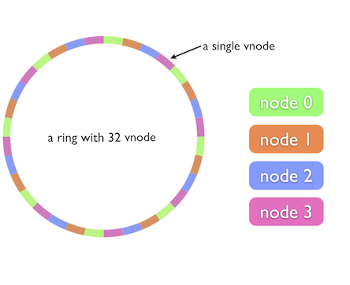

# XComponent Hello World in cluster mode

This project illustrates our clustering support applied to the [Hello World](../xc.helloworld) sample.

## Overview

XComponent is a platform to create, monitor and share microservices.
If you want to have more details about microservices, you should read [Martin Fowler's article.](http://martinfowler.com/articles/microservices.html)
 
XComponent integrated a new features which are Clustering and Failover. In order to intergrate these features, XComponent team is based on the CAP (Consistency Availability Partition tolerance) theorem which is a theorem states that it is impossible for a distributed data store to simultaneously provide more than two out of the following three guarantees:

- Consistency: Every read receives the most recent write or an error

- Availability: Every request receives a response that is not an error

- Partition tolerance: The system continues to operate despite an arbitrary number of messages being dropped (or delayed) by the network between nodes

To make things more concrete, Consistency means that every event will be executed on the most recent version of the state machine instance. Availability means that we won’t miss events. Partition tolerance means the cluster continues to operate in case of network failures.

Firstly, XComponent focused on the Consistency and High Availability criterions. Then, XComponent integrated an optional strategy in order to detect the network Partition and to react to it. This strategy consists of downing all nodes if the number of reachable ones is lower than the minimum number of members in the cluster. This minimum number is defined by the user. This strategy works well when you are able to define minimum required cluster size and when you have a cluster with fixed size of nodes or fixed size of nodes with specific role.

XComponent Cluster allows developpers to implement stateful services, which execute requests based on internal state, with High Availability (HA) and Fault Tolerance (FT). Stateful architectures are powerful, simplify deployment and the time to process requests is shorter. However, in a cluster deployment the application state is scattered across several nodes and this has major impacts on the implementation of HA and FT.

- The context of the request is important: only a node in the cluster can handle a given context because it is the owner of the corresponding state. The cluster must implement a consistent partitioning of the application state among the nodes in the cluster. This is called dynamic sharding (or partitioning). Each node owns a shard at a given time.

- When a node fails, another node in the cluster must take over requests formerly handled by the faulty node. This requires continuous state synchronization among the nodes in the cluster.

- When a node joins the cluster, it does not own any state, so it cannot process any requests. Therefore, a protocol for load balancing must be implemented natively in the cluster: old nodes will handover some of their state to the new node. This is called resharding and it is performed by a partial shard handover.

XComponent Cluster is based on [Akka.Net](https://getakka.net/articles/intro/what-is-akka.html) and [Akka.Cluster](https://getakka.net/articles/clustering/cluster-overview.html). Akka.Cluster features are based on the [cluster gossip](https://getakka.net/articles/clustering/cluster-overview.html#cluster-gossip), a distributed protocol implemented between cluster nodes (cluster members) that allows new nodes/members to join the cluster, existing nodes to leave it and a leader of the cluster to be elected. When the cluster gossip converges, the cluster has an elected leader that undertakes cluster actions like declaring as Up members that joined, declaring as Unreachable members for which a majority of nodes confirms they are unreachable. 

For the dynamic sharding, XComponent Cluster implemented its own strategy based on consistent hash ring technique inspired by the [Chord](https://pdos.csail.mit.edu/papers/chord:sigcomm01/chord_sigcomm.pdf) algorithm in order to perform state machine instance sharding. Load balancing within a cluster with Consistent Hash ring technique allows load distribution between different cluster nodes based on a Hash Code value. In order to have a uniform distribution within the cluster, we use the Consistent Hash ring approach based on virtual nodes. This approach consists of creating replicas of the cluster nodes called virtual nodes. The following figure illustrates the basic idea of this approach.



This is an example of a cluster of 4 nodes. For each node, instead of adding one point on the ring, we add r points, called replicas. Replica ids are generated simply from the node id,
by concatenating the node id with 0, 1, …, r. For this example, r = 8, so each node will have 8 replicas in the ring. This way, node replicas will be interleaved and during dynamic topology:
- All the nodes will hand over a small amount of the instances they own to the new nodes in the cluster

- All the nodes will take over a small amount of the instances of a removed node previously owned

When a new node joins the cluster, it must point to an existing node as a **seed**, which can be any node in the cluster. The first node joining the cluster uses its own address as a seed, it does a self-join which creates the cluster with one node. 

## The example

In the `Hello World in Cluster Mode` sample, we're going to use the `Hello World` project and run two different pieces of software concurrently:

* **`[Hello World microservice]`** - A microservice launched on a 3 nodes cluster that receives *say hello* requests and prints them to the console.
* **`[Console Application]`** - A simple application to send requests to the hello world cluster.

## Build the project

Execute the following script from the directory `xc.helloworld`:
```
PS > ./build.ps1
```

## Run the "Hello World" example in cluster mode

Execute the following script from the directory `xc.helloworld`:
```
PS > ./runCluster.cmd
```
Enter a name in the displayed console and see the logs of the launched runtimes (3 launched nodes). You will see a message in green color displayed in the console of the owner node.

Entering a name in the console creates a new instance of the state machine `HelloWorldResponse`. This instance is created in the owner node and replicas of this instance are created in the other nodes
in order to handle the failover and to ensure the high availability.

If you kill a node from the cluster, you will see that the other nodes will share all the requests (instances) handled by the
removed node.

> Note: RabbitMQ has to be running (default configuration) 

## Questions?

If you have any questions about this sample, please [create a Github issue for us](https://github.com/xcomponent/xcomponent/issues)!
