# Order Processing: step by step tutorial

This document describes how to create a simple and naïve `Order Processing` microservice with XComponent.
It gives new joiners a quick overview of the various tools of the platform (XCStudio, XCPlayer, XCTools, Client applications) and of the modeling abstractions (APIs, components, state machines, transitions and their interactions). 

## Overview

In the `Order Processing` sample we're actually going to run three different pieces of software concurrently:
* **`[Order Processing microservices]`** - A microservice that receives *order creation* and *order execution* requests. A microservice that executes trades. Splitting this simple system in two components may seem overkill, but in a real world use case, trade execution can require more resources as it is related, for instance, to book management, risk calculations, so it might be interesting to isolate it in a separate, independently deployed microservice. As we will see, we can start development with a single microservice, but isolating trade execution in a separate component facilitates splitting our microservice later in two distinct microservices. 
* **`[Console Application]`** - A simple application to test our microservice. Before implementing 
this console you will test the microservice with XC Spy.

An order creation request is defined by an asset name and a quantity. In response to such requests the system creates an order pending for execution and a corresponding trade with the specified quantity waiting for execution.

An order execution request is defined by an order id, a quantity and a price. An execution request can be interpreted as partial or full, depending on whether the execution quantity is lower than the remaining quantity of the target order or equal to it. In response to partial executions, the system updates the order state to partially executed, modifies the quantity of the correspondent trade waiting for execution and marks the trade as executed, while creating an additional trade waiting for subsequent executions of the remaining quantity. In case of full execution requests (execution of all the remaining quantity), the order and the trade currently waiting for execution change state are marked as executed. In both these cases the price specified in the execution request is recorded in the trade object.

Cancellation is not implemented on purpose, because it can be a good exercise for the reader at the end of the tutorial to add order cancellation features to the system.

We can depict the two main parts of the system through two state machines:

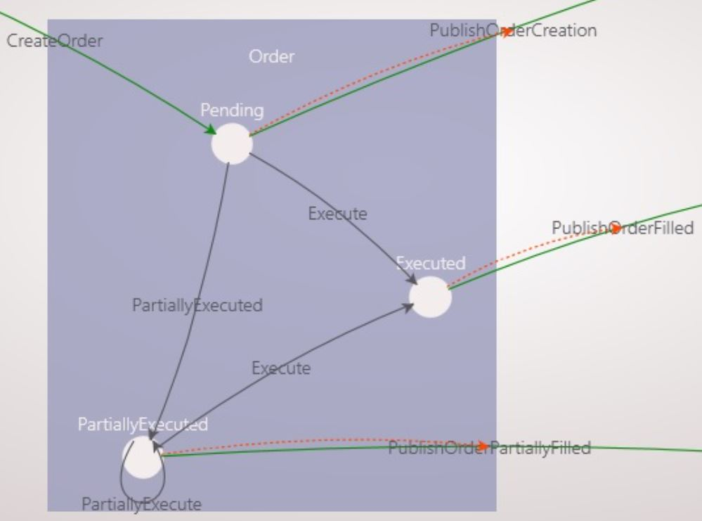&nbsp;&nbsp;&nbsp;&nbsp;&nbsp;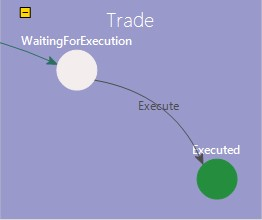

## Create the microservice

### Create a new XComponent project

* Start XCStudio **`[packages\XComponent.Community\tools\XCStudio\XCStudio.exe]`**

* Create a new project named **`OrderProcessing`**:

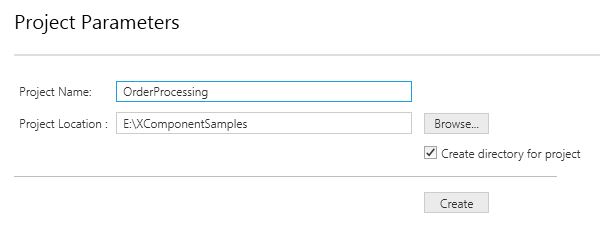

> Note: this automatically creates the OrderProcessingApi which we will use later.

### Implement the Order component

Our target goal is to build an Order component with the following overall structure:

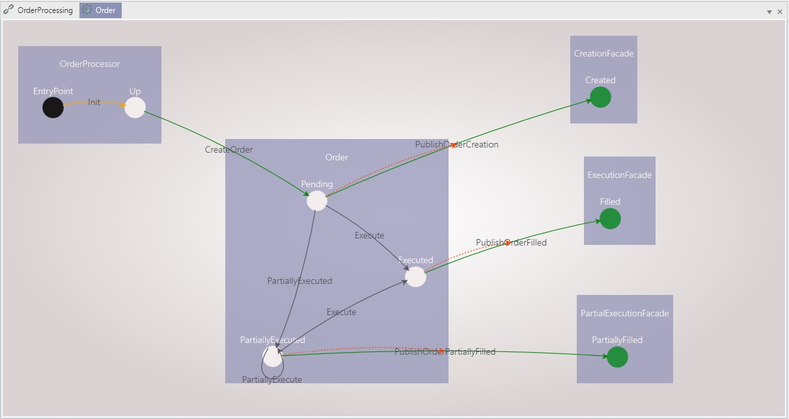

* Create a new *component* named **`Order`**:

&nbsp;

> Note: In XComponent, a component is a set of state machines.

 * Rename the automatically created statemachine *Order* to *OrderProcessor*. 

> Note: The entry point state machine will be used as a rather technical part of the system, which listens to external order creation requests (it could also handle business validation on the incoming creations requests before actually creating orders, but this is out of the scope of this example)
 
 * Add a state Up to the OrderProcessor state machine
 * Link the EntryPoint state to the Up state through a transition named Init with Triggering event “DefaultEvent” 
 * Set the timeout of the newly created Init transition to 0, meaning that it will be automatically triggered when the component will be initialized

 You should end up with the following entry point state machine:

 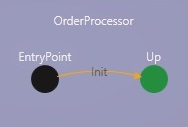

* Create the main state machine of the Order component. 

> Note: The implementation of the Order state machine aims at reducing the number of user objects needed and the number of triggered methods to be implemented so that duplication is reduced as much as possible.
In order to reduce the number of user objects we use the same triggering event for all transitions and discriminate between several transitions of a given state (e.g. Pending) with a mix of matching and specific triggering rules. Matching rules use order ids for optimal selection performance in a first step, while specific rules rely on other properties to select among the available transitions (e.g. Execute vs PartiallyExecute) of an already matched instance. We end up with 3 user objects (OrderInput, OrderExecution, corresponding to creation and execution requests respectively, and Order which is the main business object). On the other hand, the technique of naming the same way two incoming transition with the same triggering event (e.g. PartiallyExecuted has two incoming transition named PartiallyExecute, both being triggered by OrderExecution events) allows one to define only one triggering method per state (although one could argue that ExecuteRemaining would be clearer when leaving the state PartiallyExecuted).

* Create the user objects needed by the component OrderService 
 
> Note: Make sure the window Add new class is enabled and use its Add button
   
   * OrderInput  
   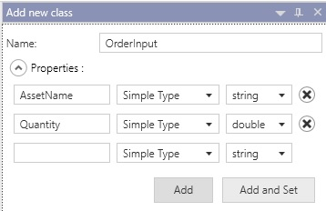
   
   * ExecutionInput  
   
   
   * OrderCreation  
   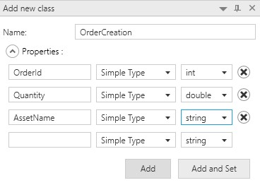
   
   * OrderExecution  
   
   
   * Order. First create the class through the XCStudio UI with the following fields:  
   
    
   Then And add the following properties to the class Order directly via the *Edit in Visual studio* button, 
   because RemainingQuantity is a read-only calculated property and CreationDate/ExecutionDate are 
   DateTime respectively DateTime? properties, currently not supported in the UI:
   > Note: you need to build the component once in order to edit the code in Visual Studio
   
```cs
        public double RemainingQuantity
        {
            get { return Quantity - ExecutedQuantity; }
        }

        public DateTime CreationDate { get; set; }

        public DateTime? ExecutionDate { get; set; }
```
 
* Create the CreationFaçade state machine
	* Add a new state machine named CreationFacade with one state Created.
	 This will serve as output façade of the Order component for external components interested in 
	 order related events. Use OrderCreation as public member of the state machine.

* Create the Order state machine 
   * Add a new state machine named Order with a state Pending. 
   Use Order as public member of the state machine  
   * Draw a transition named CreateOrder from OrderProcessor.Up to Order.Pending, 
   using a triggering event of type OrderInput
   * Draw a transition named PublishOrderCreation from Order.Pending to CreationFacade.Created and 
   make it triggerable through code (drag and drop the state on the transition 
and make sure to check Triggerable Transition in the properties window). 
Use a triggering event of type OrderCreation  
 * Select the Order.Pending state and check the triggered method CreateOrder (OrderInput).  
   * Build the component, then edit it in Visual Studio. Define a static field currentOrderId in the
   class `OrderTriggeredMethod` and then use the following implementation for
   the triggered method:
> Note: This code updates the public member of the Order state machine by setting an id and the property values (when a state machine is initialized, the public member has default values for all properties). It then triggers the PublishOrderCreation transition so that the event is visible to external components and/or microservices. 
```cs
            private static int currentOrderId;
    
            public static void ExecuteOn_Pending_Through_CreateOrder(XComponent.Order.UserObject.OrderInput orderInput, XComponent.Order.UserObject.Order order, object object_InternalMember, RuntimeContext context, ICreateOrderOrderInputOnPendingOrderSenderInterface sender)
            {
                order.Id = System.Threading.Interlocked.Increment(ref currentOrderId);
                order.Quantity = orderInput.Quantity;
                order.AssetName = orderInput.AssetName;
                order.CreationDate = DateTime.Now;
                sender.PublishOrderCreation(context, new XComponent.Order.UserObject.OrderCreation
                {
                    OrderId = order.Id,
                    AssetName = order.AssetName,
                    Quantity = order.Quantity
                });
            }
```
  
   * At this point you should have the following state machine model defined for the Order component:
   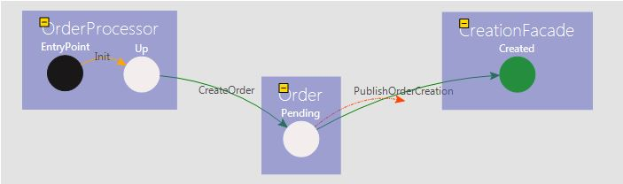
   
* Compose links to the API
> In order to use the Order component we need to connect its inputs and outputs to the API.

 * Open the Composition view and create the following composition links between the API and the component:
   * From the OrderProcessingApi to the Order.OrderProcessor.Up state
   > This allows clients of the API to create orders via the "fork" transition CreateOrder
   * From the Order.CreationFacade state machine to the API
   > This allows clients of the API to be notified of new instances of the CreationFacade state 
   machine
   
   You should end up with the following composition diagram   
   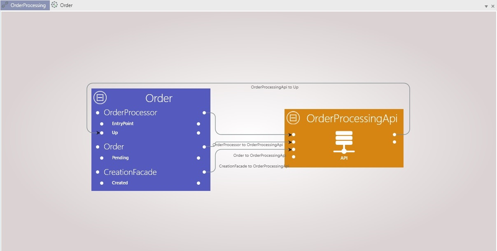
 
 * Build the composition for the project
 
    

 * Start XC Spy
 
   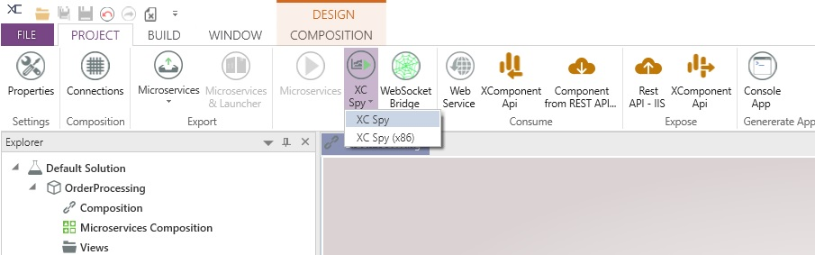
   
    Under the OrderProcessingApi tab, open the Order component and 
 use the Get Snapshots to obtain up to date information on the entry point instance
  
   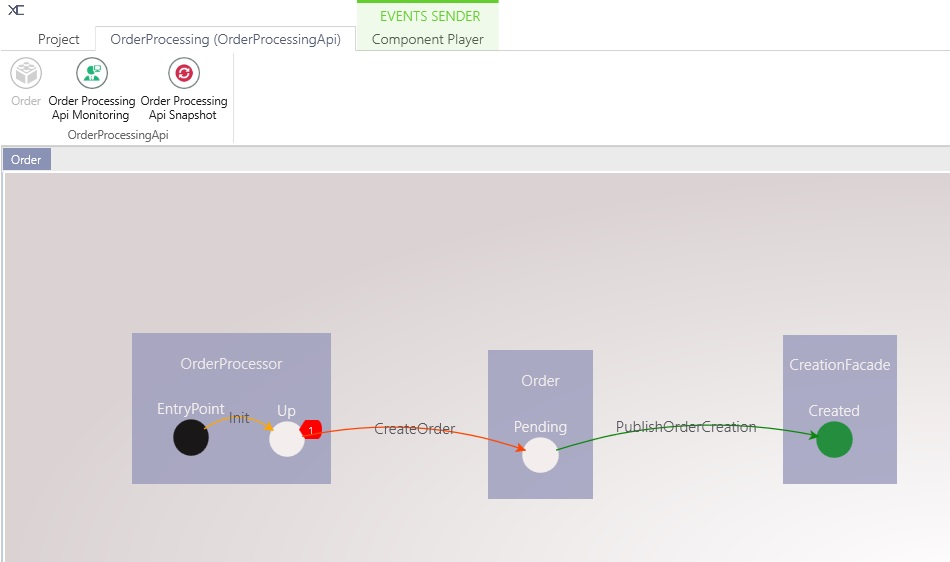
 
 * Trigger an event CreateOrder. In order to do so, make sure the Properties window is displayed (in the menu click on Project and then Properties)
     * Select the CreateOrder transition
     * In the Properties window enter an event with AssetName INVIVOO and quantity 100 
     * In the menu click on Component Player and then on Send event to selected instance
     * You should see a new instance of CreationFacade in Created state, which means that your component works as expected so far 
   
      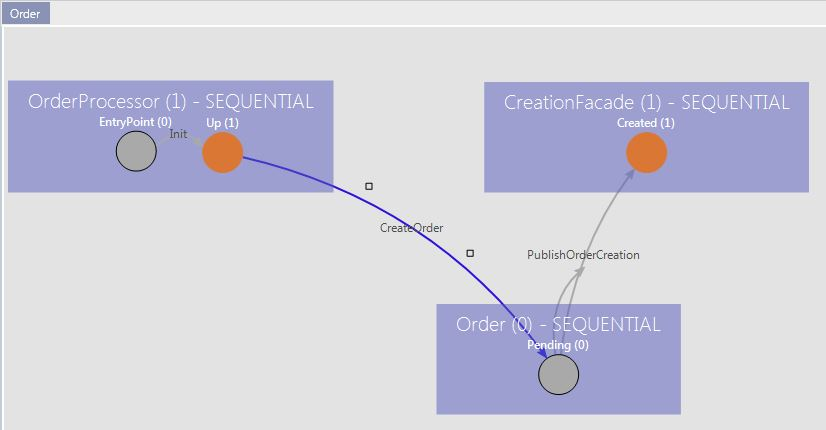
    > Note: 
    > Inspect the instance by selecting its state machine in the spy. You will notice that its 
    properties have only default values (OrderId 0, AssetName "" and Quantity 0). 
    This is because we have never updated the public member of CreationFacade with values 
    received in the triggering event of the PublishOrderCreation transition. 
    This conversion because has to be done manually in a triggered method. 
 * Fix the problem described above with the public member of CreationFacade not being initialized 
 properly
  
 * Go to the Order component view and check the triggered method for PublishOrderCreation in the state 
   CreationFacade.Created. 
     * Navigate to the method `CreationFacadeTriggeredMethod.ExecuteOn_Created_Through_PublishOrderCreation`, 
     use the following clone call and save the changes:
```cs
		public static void ExecuteOn_Created_Through_PublishOrderCreation(XComponent.Order.UserObject.OrderCreation orderCreation_TriggeringEvent, XComponent.Order.UserObject.OrderCreation orderCreation_PublicMember, object object_InternalMember, Context context, IPublishOrderCreationOrderCreationOnCreatedCreationFacadeSenderInterface sender)
		{
			XComponent.Common.Clone.XCClone.Clone(orderCreation, orderCreation_PublicMember);
		}
```
     
     
 * Go back to XCStudio, rebuild the linking and restart the player. Redo the same test and note that the instance created for CreationFacade has now a public member with the correct values for its properties
 
 
 * Add implementation for order execution scenarios
 > Note: For the next steps there will be less detailed guidance, but with the most of the remaining implementation is 
 similar to what has been done so far in the case of order creation requests.
 
* Add two new state machines ExecutionFacade with one state Filled and PartialExecutionFacade with one state PartiallyFilled, both with a public member of type OrderExecution. At this point your component should have the following structure:
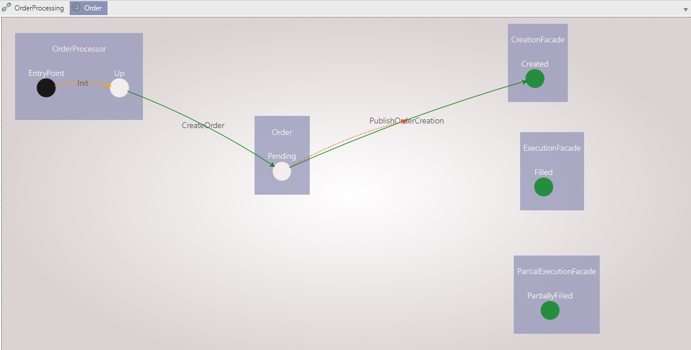

* Link outputs of the two new façade state machines to the API. The composition should be as bellow:
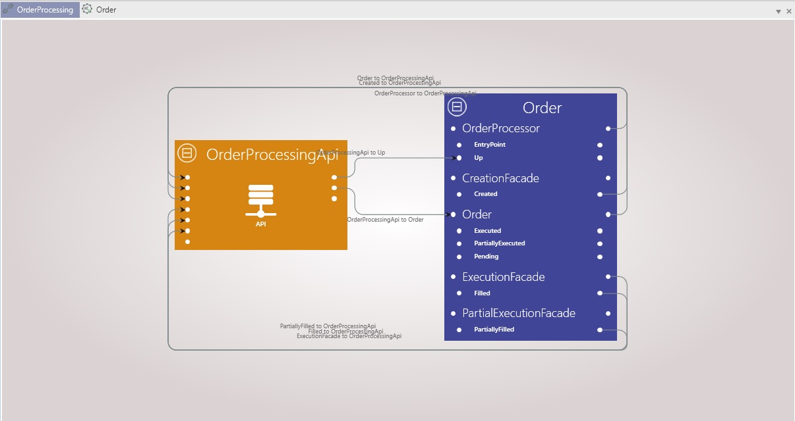

* Add all the necessary states and transitions in order to reach the following model for the OrderService component:
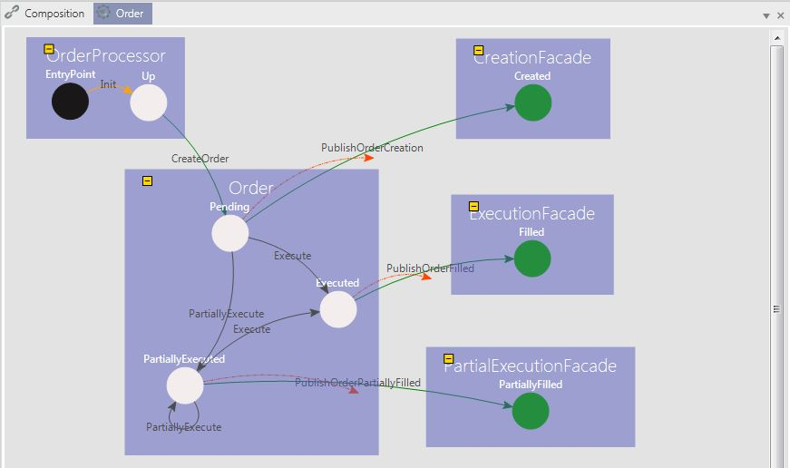
      
* All the newly added transitions of the Order state machine use ExecutionInput as triggering event. Set up a matching 
      rule ExecutionInput.OrderId = Order.Id on each new transition of the Order state machine 
      (Execute x 2 and PartiallyExecute x 2). 
* Both the PublishOrderFilled and PublishOrderPartiallyFilled transitions use OrderExecution as
       triggering event. 
       
    At this point, building the component OrderService will give the following errors:
    > 17:27:31 [ ERROR ]  All transitions from state Pending using the same event are using one or several matching property in common, but none can be used to differentiate them (this could be because they all have the same property on the right hand side of the equality) (Component: Order, StateMachine Id: 2, State Id: 3).

    > 17:27:31 [ ERROR ]  The state Pending is using the same event for several transitions, but does not specify a matching rule on the transition name to differentiate them (Component: Order, StateMachine Id: 2, State Id: 3).

    > 17:27:31 [ ERROR ]  All transitions from state PartiallyExecuted using the same event are using one or several matching property in common, but none can be used to differentiate them (this could be because they all have the same property on the right hand side of the equality) (Component: Order, StateMachine Id: 2, State Id: 8).

    > 17:27:31 [ ERROR ]  The state PartiallyExecuted is using the same event for several transitions, but does not specify a matching rule on the transition name to differentiate them (Component: Order, StateMachine Id: 2, State Id: 8).

    This is because each of the states Pending and PartiallyExecuted have 2 transitions with the same triggering event and the same matching rule. In order to distinguish them we have to add a specific triggering rule for these transitions, while maintaining the initial matching on the order id. Enable the user specific rules for all the Execute and PartiallyExecute transitions, rebuild the component (note that the errors are no longer raised) and then edit their code. 

    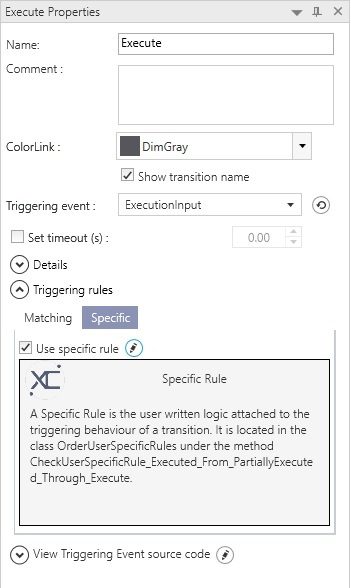

* Implement specific rules for the Execute and PartiallyExecute transitions
    * For Execute transitions use    
```cs 
            return executionInput.Quantity == order.RemainingQuantity;
```
    * For PartiallyExecute transitions use
```cs 
	       return executionInput.Quantity != order.RemainingQuantity;
```
    * Check the triggered method Execute in the Executed state and PartiallyExecute in 
      the PartiallyExecuted state. Rebuild the component. Use the following code for these two 
      methods: 
```cs 
		public static void ExecuteOn_Executed_Through_Execute(XComponent.OrderService.UserObject.ExecutionInput executionInput, XComponent.OrderService.UserObject.Order order, object object_InternalMember, Context context, Execute_ExecutionInput_OnExecuted_OrderSender sender)
		{
			double quantityToExecute = executionInput.Quantity;

			order.ExecutedQuantity += quantityToExecute;
			order.ExecutionDate = DateTime.Now;

			sender.PublishOrderFilled(context, new OrderExecution {
				OrderId = order.Id,
				AssetName = order.AssetName,
				Quantity = quantityToExecute,
				RemainingQuantity = 0,
				Price = executionInput.Price
			});

		}
        
		public static void ExecuteOn_PartiallyExecuted_Through_PartiallyExecute(XComponent.OrderService.UserObject.ExecutionInput executionInput, XComponent.OrderService.UserObject.Order order, object object_InternalMember, Context context, PartiallyExecute_ExecutionInput_OnPartiallyExecuted_OrderSender sender)
		{
			double quantityToExecute = executionInput.Quantity;

			if (quantityToExecute > order.RemainingQuantity) {
				throw new Exception(string.Format("[Order {0}]: This is not a valid partial execution. Requested quantity {1} was bigger than the remaining quantity {2}", order.Id, quantityToExecute, order.RemainingQuantity));
			}

			order.ExecutedQuantity += quantityToExecute;

			sender.PublishOrderPartiallyFilled(context, new OrderExecution {
				OrderId = order.Id,
				Quantity = quantityToExecute,
				RemainingQuantity = order.RemainingQuantity,
				Price = executionInput.Price
			});
		}
```

   > Note that, obviously, we could do better than raising a generic Exception, but we don't care in this context ;)

- The last bit is to properly set the public member properties for the two new façade machines, ExecutionFacade and PartialExecutionFacade, when the transitions PublishOrderFilled and PublishOrderPartiallyFilled are triggered respectively. 
      Check the triggered methods PublishOrderFilled on ExecutionFacade.Filled and PublishOrderPartiallyFilled on 
      PartialExecutionFacade.PartiallyFilled. Rebuild the component and then edit each the triggered methods and uncomment the clone method call. You
      should end up with : 
```cs
	public static class ExecutionFacadeTriggeredMethod
	{

		/// <summary>
		/// Executing triggeredMethod ExecuteOn_Filled_Through_PublishOrderFilled
		/// </summary>
		public static void ExecuteOn_Filled_Through_PublishOrderFilled(XComponent.Order.UserObject.OrderExecution orderExecution_TriggeringEvent, XComponent.Order.UserObject.OrderExecution orderExecution_PublicMember, object object_InternalMember, Context context, IPublishOrderFilledOrderExecutionOnFilledExecutionFacadeSenderInterface sender)
		{
			XComponent.Common.Clone.XCClone.Clone(orderExecution_TriggeringEvent, orderExecution_PublicMember);
		}
	}

	public static class PartialExecutionFacadeTriggeredMethod
	{

		/// <summary>
		/// Executing triggeredMethod ExecuteOn_PartiallyFilled_Through_PublishOrderPartiallyFilled
		/// </summary>
		public static void ExecuteOn_PartiallyFilled_Through_PublishOrderPartiallyFilled(XComponent.Order.UserObject.OrderExecution orderExecution_TriggeringEvent, XComponent.Order.UserObject.OrderExecution orderExecution_PublicMember, object object_InternalMember, Context context, IPublishOrderPartiallyFilledOrderExecutionOnPartiallyFilledPartialExecutionFacadeSenderInterface sender)
		{
			XComponent.Common.Clone.XCClone.Clone(orderExecution_TriggeringEvent, orderExecution_PublicMember);
		}
	}
```

 * In order to be able to execute orders we need to expose the Order state machine through the API. Add the following links
 in the composition view:
   * From Order.Order state machine to OrderProcessingApi: this allows you to monitor state changes for orders
   * From OrderProcessingApi to Order.Order state machine: this allows you to send ExecutionInput events to already created orders 
 
 * Rebuild the whole project by relinking it and retest everything in the player with at least two scenarios: Order creation + full execution, Order creation 
 with partial execution and then execution of the remaining quantity. When testing executions make sure
 you enter the correct OrderId value for the target order (you can find its id by inspecting instance properties
 on the Order state machine)
 
 You have just completed the implementation of the Order component.
 
 
### Implement the Trade component

Our target goal is to build a Trade component with the following overall structure:
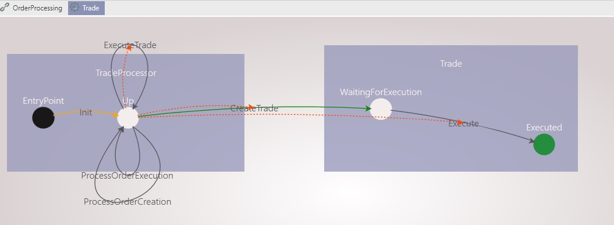

> Note that it is practical to have a state other than the EntryPoint in the initial state machine because this enables us to link back from the Trade state machines to the additional state TradeProcessor.Up and to create recursive transitions which handle external events from incoming component links (whereas it is not possible to have transition targeting the EntryPoint state directly).

Here is a step by step guide to implementing the Trade component

 * Create the Entry point state machine
   * Add a new component named Trade and rename the automatically created StateMachine1 to 
   TradeProcessor. 
   * Add a state Up to the TradeProcessor machine the same way you previously did with the OrderProcessor 
   machine from the Order component:
   
   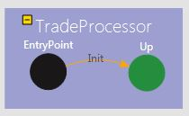

 * Create the Trade user object
   * Create the class through XC Studio as bellow using the Add button:
 
    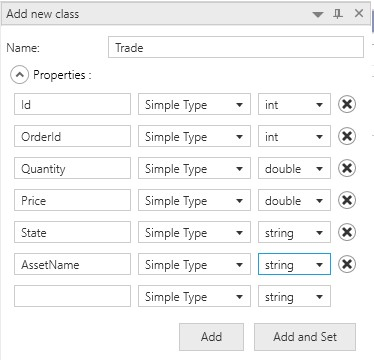
   * Build the Trade component and edit the component in Visual Studio
   * Add the ExecutionDate property to the class Trade directly in Visual Studio:
```cs
        private DateTime? executionDate;

        public DateTime? ExecutionDate
        {
            get { return executionDate; }
            set { executionDate = value; }
        }
```
   * Add a reference to the Order component so that user objects published by its facades (OrderCreation and OrderExecution) are available in the Trade component. 
   To do so, in the Trade component, click on Component => Edit (in References) and check Order, then rebuild the Trade component.
 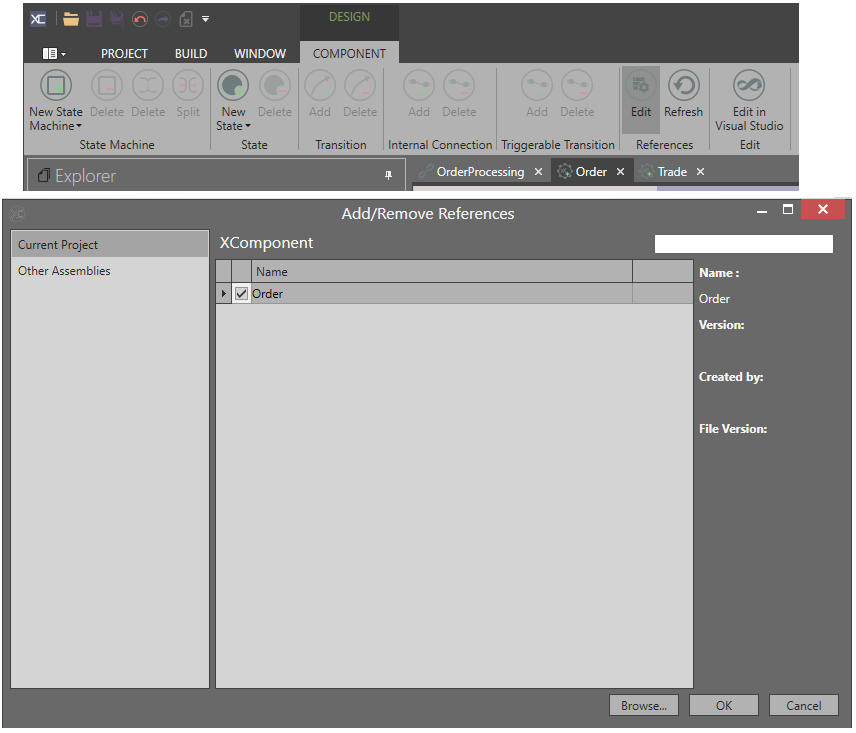

 * Create the TradeExecution user object:
 
 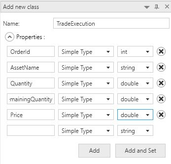
 * Create the Trade state machine
   * Add a new state machine named Trade with a state WaitingForExecution. Use Trade as public member
   * In order to monitor the state of trades in a more convenient way, map the property State to the state of the Trade machine (in the property window, State copy property => State).
 * Handle incoming OrderCreation events
   * Add a recursive transition named ProcessOrderCreation in the state TradeProcessor.Up with a triggering event of type OrderCreation.
   > Note: this transition will get outputs from the Order component, sent via a composition link which will be added later
   * Add a transition from TradeProcessor.Up to Trade.WaitingForExecution named CreateTrade with a triggering event of type Trade. Make this transition triggerable via a sender. 
   * Edit the Trade component code in Visual Studio and add a static utility class TradeFactory in the project
   XComponent.Trade.TriggeredMethod with the following contents:
```cs
    using System.Threading;

    namespace XComponent.Trade.TriggeredMethod
    {
        public static class TradeFactory
        {
            private const int MarketPrice = 100;
            private static int currentId;
    
            public static Trade.UserObject.Trade CreateNewTrade(int orderId, double quantity, string assetName)
            {
                return new Trade.UserObject.Trade()
                {
                    Id = GenerateTradeId(),
                    OrderId = orderId,
                    Price = 100.0,
                    Quantity = quantity,
                    AssetName = assetName
                };
            }
    
            private static int GenerateTradeId()
            {
                return Interlocked.Increment(ref currentId);
            }
    
        }
    }
```
   * Select the TradeProcessor.Up state, check the triggered method ProcessOrderCreation (OrderCreation) and rebuild the component. Edit it in visual studio and use the following implementation: 
```cs
sender.CreateTrade(context, TradeFactory.CreateNewTrade(orderCreation.OrderId, orderCreation.Quantity, orderCreation.AssetName));
```
   * Select the state Trade.WaitingForExecution, check the triggered method CreateTrade (Trade) and rebuild the component. Edit it in visual studio and uncomment the clone method call:
```cs
    public static void ExecuteOn_WaitingForExecution_Through_CreateTrade(XComponent.Trade.UserObject.Trade trade_TriggeringEvent, XComponent.Trade.UserObject.Trade trade_PublicMember, object object_InternalMember, Context context, ICreateTradeTradeOnWaitingForExecutionTradeSenderInterface sender)
    {
        XComponent.Common.Clone.XCClone.Clone(trade_TriggeringEvent,trade_PublicMember);
    }
```

* Handle incoming OrderExecution events 
 - In the Trade state machine add a state Executed 
 - Create a transition named Execute between Trade.WaitingForExecution and Trade.Executed, with a triggering event of type TradeExecution and a triggering rule based on the matching TradeExecution.OrderId = Trade.OrderId
 - Draw a triggarable transition from the state TradeProcessor.Up to the transition Trade.Executed
 - Create a recursive triggerable transition named ExecuteTrade on the state TradeProcessor.Up, with a triggering event of type TradeExecution. 
 - Select the state TradeProcessor.Up, check the triggered method ExecuteTrade (TradeExecution) and rebuild the component. Edit the method in Visual Studio and use the following code (which simply triggers the transition Execute on the Trade state machine:
```cs
		public static void ExecuteOn_Up_Through_ExecuteTrade(XComponent.Trade.UserObject.TradeExecution tradeExecution, object object_PublicMember, object object_InternalMember, Context context, IExecuteTradeTradeExecutionOnUpTradeProcessorSenderInterface sender)
		{
			sender.SendEvent(StdEnum.Trade, tradeExecution);
		}
```
 - Add a recursive transition ProcessOrderExecution in the state TradeProcessor.Up with a triggering event of type OrderExecution. 
 -	Select the state Trade.Executed, check the triggered method Execute (TradeExecution) and rebuild the component. Edit this method in Visual Studio and use the following code for its implementation:
```cs
		public static void ExecuteOn_Executed_Through_Execute(XComponent.Trade.UserObject.TradeExecution tradeExecution, XComponent.Trade.UserObject.Trade trade, object object_InternalMember, Context context, IExecuteTradeExecutionOnExecutedTradeSenderInterface sender)
		{
			trade.Quantity = tradeExecution.Quantity;
			trade.Price = tradeExecution.Price;
			trade.ExecutionDate = DateTime.Now;
		}
```
 - Select the state TradeProcessor.Up, check the triggered method ProcessOrderExecution (OrderExecution) and rebuild the component. Edit this method in VS and use the following code for its implementation:
```cs
		public static void ExecuteOn_Up_Through_ProcessOrderExecution(XComponent.Order.UserObject.OrderExecution orderExecution, object object_PublicMember, object object_InternalMember, Context context, IProcessOrderExecutionOrderExecutionOnUpTradeProcessorSenderInterface sender)
		{
            // Execute the existing trade for a revised quantity
			var tradeExecution = new TradeExecution {
				AssetName = orderExecution.AssetName,
				OrderId = orderExecution.OrderId,
				Price = orderExecution.Price,
				Quantity = orderExecution.Quantity,
				RemainingQuantity = orderExecution.RemainingQuantity
			};
			sender.ExecuteTrade(context, tradeExecution);

            // Create a new trade for the remaining quantity
			if (orderExecution.RemainingQuantity > 0) {
				sender.CreateTrade(context, TradeFactory.CreateNewTrade(orderExecution.OrderId, orderExecution.RemainingQuantity, orderExecution.AssetName));
			}
		}
```

 At this point you should have the following model defined for the Trade component:

 

* Expose the Trade component through the API
	- Create the following links so that the TradeService events are available to listening clients (e.g. the Player in our tests). Note that the simplified link model below is a simplified view containing the TradeService and the API only. The OrderService component was omitted for the sake of simplicity.
		- From Trade.TradeProcessor state machine to OrderProcessingApi
		- From Trade.Trade state machine to OrderProcessingApi 
	- Your composition view should look like this at this stage:

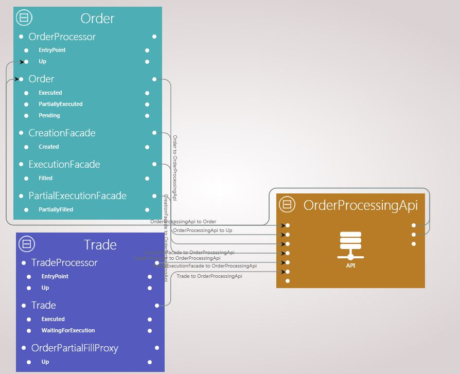

 You have just completed the implementation of the trade service!
 
### Composing your microservice input output links

The Trade component uses OrderCreation and OrderExecution inputs, which are outputs of the Order 
component through the Facade state machines. The composition view allows us to assemble our 
two components so that order outputs are properly injected as trade inputs. We need to map OrderService façade outputs to correspondent TradeService inputs as follows
* Link the state Order.CreationFacade.Created to the state Trade.TradeProcessor.Up
* Link the state Order.ExecutionFacade.Filled to the state Trade.TradeProcessor.Up
* Link the state Order.PartialExecutionFacade.PartiallyFilled to the state Trade.TradeProcessor.Up

Your final composition view should look like:

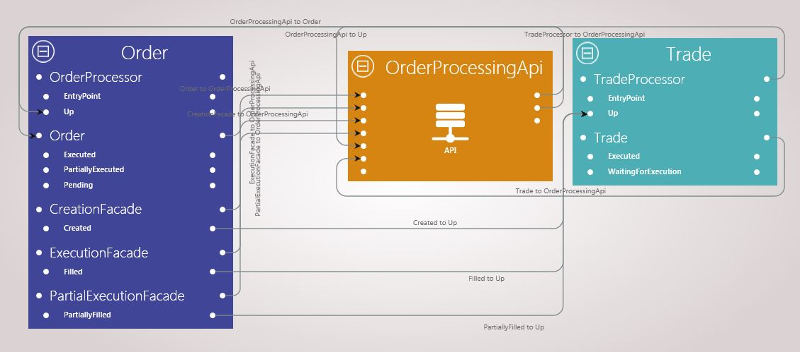

We are done! Perform a build of the composition and then retest all the scenarios with the player. When doing so, make sure you display both the Trade and the Order components, so that you can verify the interaction between them functions as expected. Namely, you should check that
whenever an order is created, a Trade is created in the state WaitingForExecution, when an order is fully executed, the correpsondent trade is executed as well and, finally, when an order
is partially executed, the correspondent trade is executed for the partial quantity and a new trade is created in WaitingForExecution for the remaining quantity. 

## Configuration

### Communication Layer

* Open the properties window of your project (see following figure)

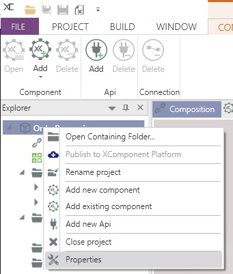

* Add rabbitmq settings:

In the *Communication* section choose a name for the rabbitmq bus and click on the *Add* button.
You should see your bus with a green indicator as in the following figure:

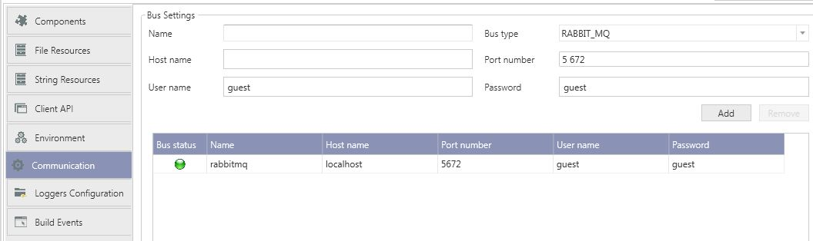

* Set the deployment target to *server*

In the *Components* section change the Deployment Target from *Stand Alone* to *Server*.
In the drop down you should see the previously configured rabbitmq bus.

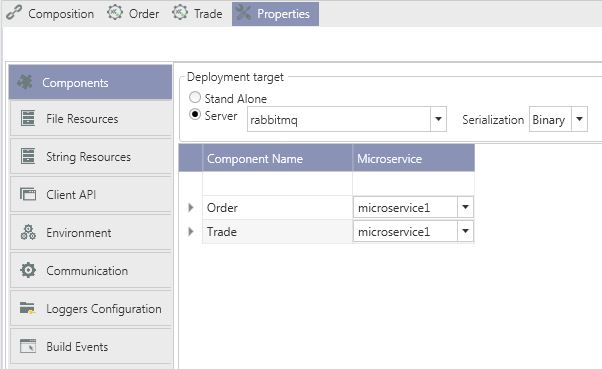

### Microservices composition

* In *Explorer* panel, double click on *microservices composition*
* Rename your microservice (containing your *Order* and *Trade* components) to *OrderProcessingMicroservice*

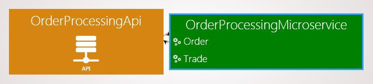

> Note: To rename a microservice, just right click on its name and select *rename microservice*. 

* Move the Trade component to a new microservice called *TradeProcessingMicroservice*:

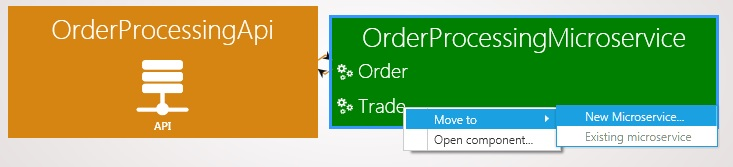

* You should end up with the following microservices

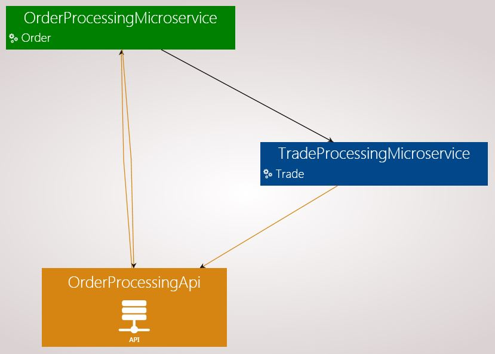

## Test your microservice

* Build the composition of your project
* Start your microservice (*Project* menu + *Run microservices* sub menu + *Start* button)
* Create a simple console application named OrderProcessingClient in order to test your microservice (*Project* menu + *Generate console app* sub menu)

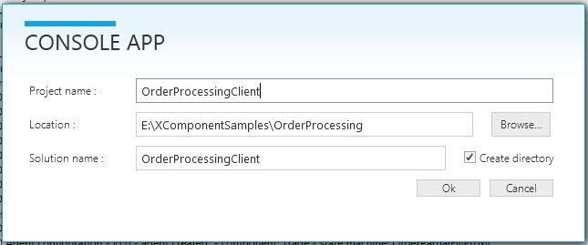
* Copy/Paste the following code in *Program.cs*
```cs
using System;
using System.Threading;
using XCClientAPICommon.Client;
using XCClientAPICommon.ApiExtensions;
using XComponent.OrderProcessing.OrderProcessingApi;
using XComponent.Order.UserObject;
using XComponent.OrderProcessing.OrderProcessingApi.Order;
using XComponent.OrderProcessing.OrderProcessingApi.Trade;


namespace OrderProcessingClient
{
    class Program
    {
        static void AnalyseReport(InitReport report)
        {
            if (!string.IsNullOrEmpty(report.Message))
            {
                Console.WriteLine("Init failed : {0}", report.Message);
            }
            foreach (var componentName in report.ComponentsInitSucceeded)
            {
                Console.WriteLine("Init succeeded : {0}", componentName);
            }
            foreach (var componentName in report.ComponentsInitFailed)
            {
                Console.WriteLine("Init failed : {0}", componentName);
            }
        }

        static void Main(string[] args)
        {
            // Initialize the interfaces
            using (var myOrderProcessingApi = new ApiWrapper<OrderProcessingApi>())
            {
                ClientApiOptions clientApiOptions = new ClientApiOptions(); //fill this object to override default xcApi parameters

                if (myOrderProcessingApi.Init(myOrderProcessingApi.Api.DefaultXcApiFileName, clientApiOptions))
                {
                    int orderId = 0;
                    using (var orderCreationEvent = new AutoResetEvent(false))
                    {

                        // Subscribe to new order instances
                        myOrderProcessingApi.Api.Order_Component.Order_StateMachine.Pending_State.InstanceUpdated +=
                            instance =>
                            {
                                Console.WriteLine("New order pending for execution: " + DisplayOrder(instance));
                                orderId = instance.PublicMember.Id;
                                orderCreationEvent.Set();
                            };

                        myOrderProcessingApi.Api.Order_Component.Order_StateMachine.PartiallyExecuted_State
                            .InstanceUpdated +=
                            instance =>
                            {
                                Console.WriteLine("Order partially filled: " + DisplayOrder(instance));
                            };

                        myOrderProcessingApi.Api.Order_Component.Order_StateMachine.Executed_State.InstanceUpdated +=
                            instance =>
                            {
                                Console.WriteLine("Order filled: " + DisplayOrder(instance));
                            };

                        myOrderProcessingApi.Api.Trade_Component.Trade_StateMachine.WaitingForExecution_State
                            .InstanceUpdated +=
                            instance =>
                            {
                                Console.WriteLine("Trade waiting for execution: " + DisplayTrade(instance));
                            };

                        myOrderProcessingApi.Api.Trade_Component.Trade_StateMachine.Executed_State.InstanceUpdated +=
                            instance =>
                            {
                                Console.WriteLine("Trade executed : " + DisplayTrade(instance));
                            };

                        // Create an order
                        OrderInput orderInput = new OrderInput
                        {
                            AssetName = "INVIVOO",
                            Quantity = 1000
                        };

                        myOrderProcessingApi.Api.Order_Component.OrderProcessor_StateMachine.SendEvent(orderInput);
                        orderCreationEvent.WaitOne(1000);

                        // Partially fill the order
                        ExecutionInput executionInput = new ExecutionInput
                        {
                            OrderId = orderId,
                            Quantity = 250,
                            Price = 102
                        };

                        myOrderProcessingApi.Api.Order_Component.Order_StateMachine.SendEvent(executionInput);

                        // Fill the order
                        executionInput = new ExecutionInput
                        {
                            OrderId = orderId,
                            Quantity = 750,
                            Price = 101.5,
                        };
                        myOrderProcessingApi.Api.Order_Component.Order_StateMachine.SendEvent(executionInput);

                        Console.ReadKey();
                    }
                }
                else
                {
                    AnalyseReport(myOrderProcessingApi.Report);
                }
            }
        }

        private static string DisplayTrade(TradeInstance instance)
        {
            return $"Id {instance.PublicMember.Id}, OrderId {instance.PublicMember.OrderId}, Quantity {instance.PublicMember.Quantity}, Price {instance.PublicMember.Price}";
        }

        private static string DisplayOrder(OrderInstance instance)
        {
            return $"Id {instance.PublicMember.Id}, Asset {instance.PublicMember.AssetName}, Quantity {instance.PublicMember.Quantity}, Remaining {instance.PublicMember.RemainingQuantity}";
        }
    }
}
```

* Run your console application. You should end up with an output like: 


## Questions?

If you have any questions about this sample, please [create a Github issue for us](https://github.com/xcomponent/xcomponent/issues)!
