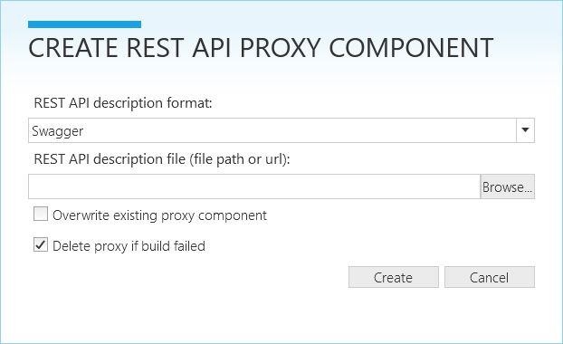
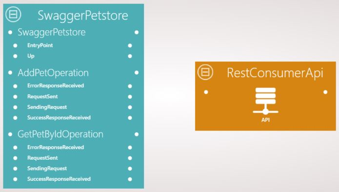
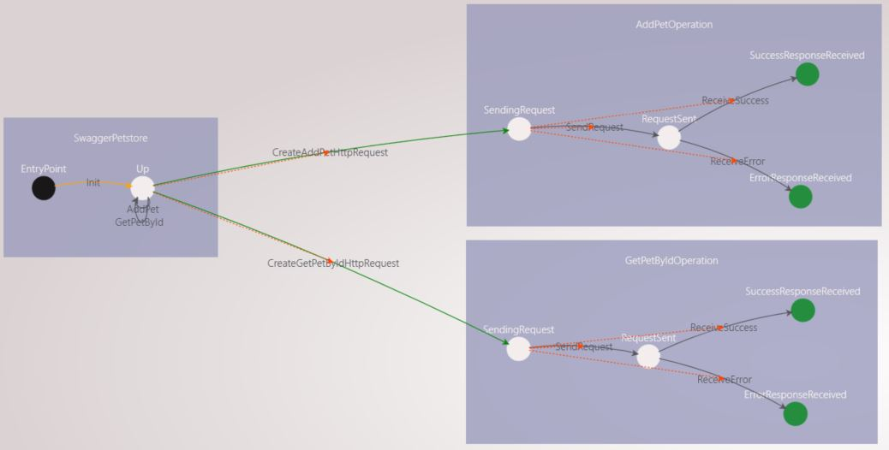
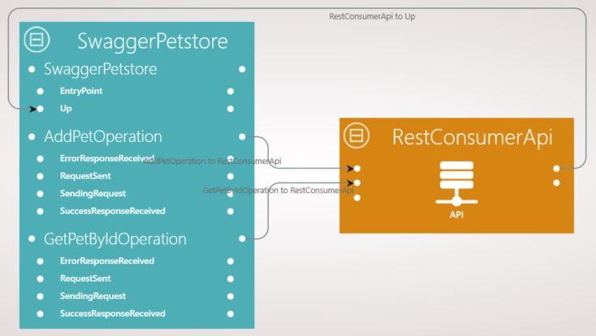
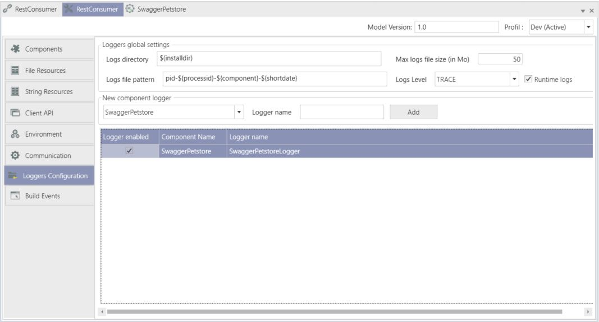
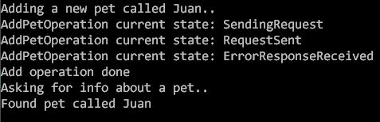

# REST API Client: project details

This document is not a step by step tutorial. If you want a step by step tutorial, you can refer to the Hello World project. 
The aim of this tutorial is to show how to consume a Restful service via XComponent.

## Overview

In the `REST API Client` sample we are going to create two pieces of software:
* **`[RestConsumer microservice]`** - A microservice that interacts with a pet store *Restful* service. 
* **`[Console Application]`** - A simple application to test our microservice

## REST API Client microservice

To be able to consume a service, we need its description. 
And Swagger is a powerful implementation for describing RESTful services. 
In Swagger, the service API is described in a human-readable JSON file.

With XCStudio you can generate a proxy component for a RESTful service based on a description of that latter.
For now XCStudio only supports Swagger format.

> Note: For more info you can check [Swagger's website](http://swagger.io/)

### Generate a Swagger Petstore service proxy

Swagger provides a sample [*Petstore*](http://petstore.swagger.io/) service.

To generate a proxy component for the *Petstore* service, we do the following:

* Go to *File > Options* and make sure we set the *Visual Studio Version* to VS2012 or any upper version.
* Go to the project's *Properties* and in the *Environment* section set the *Target framework* to "Framework45" and the *Visual Studio Version* to "VS2012" or upper.

>Note: This feature is only available for .Net framework 4.5 and upper versions.

* In the *Composition* view we go to the ribbon and click on *Add > Component from REST API...*. 
The following window should appear:

 

* Click on *Browse...* and navigate to the JSON description file.
> Note: You can either enter a file path or a url to the file. 
Swagger provides a [url](http://petstore.swagger.io/v2/swagger.json) for the Petstore service description.
There seems to be an error in that file. So we provide a corrected version with this sample. You will 
also notice that, for simplicity, we omitted many operations and only 2 of them are left. 

* Click on *Create*.

 The composition view will refresh and you will notice the newly generated component. The component's name
is generated based on the service's title present in the description. The composition view should look like the following:
 
 
  
### Explore the generated component

 Open the *SwaggerPetstore* component view. It should look like the following:
 
 
 
 * A state machine with the service's name is generated
 * Each operation available on the service is represented by a state machine
 * Each operation state machine has 4 states to describe its status:
  * SendingRequest: the http request is being constructed
  * RequestSent: the http request is sent to the server
  * SuccessResponseReceived: We end up in this state if a successful response is received
  * ErrorResponseReceived: We end up in this state when an error resonse is received
  
Calling a service operation via the component is simply sending the proper event to the service's state machine.
 
For example, if we need to call the AddPet operation we need to Send the *AddPet* event to the *SwaggerPetstore* state machine.

We can register on the instance updates of the operation's state machine for two main reasons:
* Get updates about the operation's status
* Get an eventual result (for GET methods for example). That result is present in the state machine's public member.

### Expose the operations and build the project

Now going back to the composition view, we need to expose the operations in the Api so they become visible for the component's client.

* We are only going to send events to the *SwaggerPetstore*'s *up* state. So we create a link from the Api to that state
* To be able to get the instance updates of the operations state machines we need to create links from those state machines to the Api

Our *Composition* view should look like the following:

 
 
A logger is generated and we need to enable it to be able to see the component's logs.
Go to the *Loggers Configuration* section in the project's properties and check *Logger enabled*.
Here is how the configuration section should look like:

  
  
We also have the possibility to override the service's address by defining a *String Resource* called "ServiceUri" for the *SwaggerPetstore* component.

With these configurations done, we can now build the composition.
  
## Console Application
 
* Start RabbitMQ
* Start your microservice (*Project* menu + *Run microservices* sub menu + *Start* button)
* Create a simple console application to test your microservice (*Project* menu + *Generate console app* sub menu)
* Use the *Program.cs* you can find (here)[https://github.com/xcomponent/xcomponent/blob/master/Examples/xc.restapiclient/RestConsumer/PetstoreConsoleApplication/PetstoreConsoleApplication/Program.cs]

> Note: this sample code enables you to add a pet with the name you want to the store then to request the pet's info from the server.

 Run your console application. You should end up with the following output: 

 
 
## Questions?

If you have any questions about this sample, please [create a Github issue for us](https://github.com/xcomponent/xcomponent/issues)!
