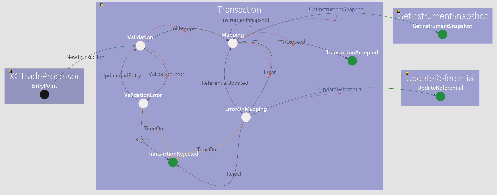
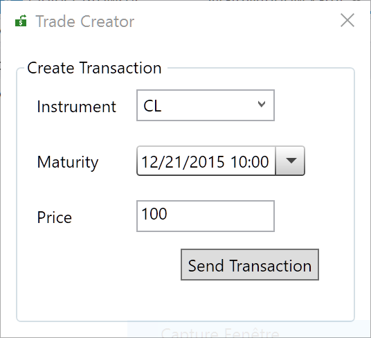
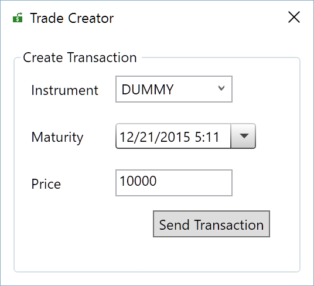
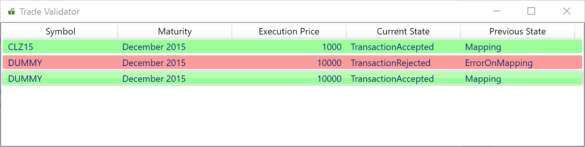

# Trade Capture: project details

This document is not a step by step tutorial. If you want a step by step tutorial, you can refer to the `Hello World` project. 

As we said earlier, the **Trade capture** is the process of booking (or capturing) the trade into the systems used within a financial organisation. 

## Overview

In this project, there are the following elements:
* 2 microservices
* 2 Wpf applications communicating with the microservices

## 1. The microservices
## Trade Capture component



The `Trade Capture` component receives new trades through the `NewTransaction` transition.
In this project, the `NewTransaction` transition is triggered by an event coming from the **TradeCreator Gui**.
Once the **Transaction** (the **Trade**) is received, the `Transaction` state machine is allocated by the **XComponent Runtime**.
The following state named `Validation` checks the parameters of the transaction. If the parameters are correct, the transaction moves on the `Mapping` state.
From this state, we request the list of the instruments available in the `Referential` component. 
* If the instrument linked to the trade is  available on the referential, the transaction is accepted.
* If the instrument linked to the trade is  not available on the referential, the transaction is on `ErrorOnMapping` state. 

### ErrorOnMapping state
* After 20 seconds in this state, the transaction is rejected
* From this state, the user (through the `TradeValidator` Gui) can reject the transaction
* From this state, the user (through the `TradeValidator` Gui) can update the referential to add the instrument. Once the referential is updated, we go back to the `Mapping` state and the transaction will be accepted.

## Referential component


This component is very simple. The **public member** of the `Referential` state machine contains the list of valid instruments. By default, the following instruments are available:
* CL (code for Crude Oil WTI Futures contract) 
* C (code for Corn Futures contract) 
* WH (code for Wheat)

New instruments can be added by triggering the `AddInstrument` transition.

> Note: This implementation is quite simple but you can easily imagine connect this component to a database without a lot of changes. 

## 2. Wpf applications

## 2.1 Trade Creator



From this simple GUI, we can create new trades. The trades have the following properties:
* An instrument code: we can set this property by selecting a code from the combo box. 
* A maturity date
* A price

### How it works ?
2.1.1 
When the application is loading, there is a call to the XComponent client api.

```cs
 Task.Factory.StartNew(() => ClientApiHelper.Instance.Init()).ContinueWith(t =>
    {
        if (t.Result)
        {
            return ClientApiHelper.Instance.Api.Referential_Component.GetEntryPoint();
        }
        return null;
    }).ContinueWith(t =>
    {
        if (t.Result != null)
        {
            var tradeCaptureViewModel = new TradeCreatorViewModel();
            foreach (var instrument in t.Result.PublicMember.Instruments)
            {
                tradeCaptureViewModel.Instruments.Add(instrument);
            }
            tradeCaptureViewModel.SelectedInstrument = t.Result.PublicMember.Instruments.FirstOrDefault();
            DataContext = tradeCaptureViewModel;
        }
        else
        {
            System.Windows.MessageBox.Show("Not connected to microservices !");
        }
    } , TaskScheduler.FromCurrentSynchronizationContext());
```

>Note: You can notice that the call to the client api is not done in the dispatcher thread. Indeed, the `Init()` and `GetEntryPoint()` methods of the client api are synchronous: so it is necessary in a GUI to call them from another thread.

Once the Api is initialized, the combo box is filled with the instruments available in the `Referential` component.

2.2.2 Create a new trade

A click to `Send Transaction` send an event to the `Trade Capture` microservices to trigger the `NewTransaction` transition.

```cs
   ClientApiHelper.Instance.Api.TradeCapture_Component.XCTradeProcessor_StateMachine.SendEvent(
                new XComponent.TradeCapture.UserObject.Transaction()
                {
                    ExecutionDate = _dealCaptureViewModel.DealMaturity,
                    Instrument = _dealCaptureViewModel.SelectedInstrument,
                    Price = _dealCaptureViewModel.DealAmountInt
                });
```

## 2.2 Trade Validator


From this simple GUI, you see the trades and the  status of the trades. 
The color of the line depends on the status of the trade:
* TransactionAccepted: green 
* TransactionRejected: red  
* ErrorOnMapping: orange


### How it works ?
2.1.1 
When the application is loading, there is a call to the XComponent client api.

```cs
 Task.Factory.StartNew(() => ClientApiHelper.Instance.Init()).ContinueWith(t =>
    {
        if (t.Result)
        {
            DataContext = new BlotterViewModel();
        }
        else
        {
            System.Windows.MessageBox.Show("Not connected to microservices !");
        }
    }, TaskScheduler.FromCurrentSynchronizationContext());
};
```

>Note: You can notice that the call to the client api is not done in the dispatcher thread. Indeed, the `Init()` method of the client api are synchronous, so it is necessary in a GUI to call them from another thread.

2.2.2 Trade Validation

The trade is on `ErrorOnMapping` state when the instrument is not available in the `Referential` microservice.
When a trade is on `ErrorOnMapping` state, you can right click on the line. You have 2 options:
* Reject the trade: The trade is rejected
* Update and Retry: This command sends a request to add the instrument in the `Referential`. Once the `Referential` is updated, the transaction is accepted.


## 3. Testing the application

* Start the microservices
* Run the GUIs

** Test 1 - Test a known instrument

In the `Trade Creator` Gui, select an instrument from the combo box and click on **Send Transaction**


In the `Trade Validator` Gui,  you can notice that the transaction is in **TransactionAccepted** status


 
 ** Test 2 - Unknown instrument which timed out
 In the `Trade Creator` Gui, enter a new instrument (named **DUMMY** in the screenshot) and click on **Send Transaction**
 



In the `Trade Validator` Gui, you can notice that the transaction is in **ErrorOnMapping** status.
After 20 seconds, the transaction will be in  **TransactionRejected** status.


** Test 3 - Accept an unknown instrument 

 In the `Trade Creator` Gui, enter a new instrument (named **DUMMY** in the screenshot) and click on **Send Transaction**
 


In the `Trade Validator` Gui, you can notice that the transaction is in **ErrorOnMapping** status.


Right click on the "orange line" and select `Update and retry`. Then, the transaction is accepted.



You should also notice that the combo box has been updated with this new instrument in `Trade Validator` Gui.


All the transactions with "**DUMMY**" instrument will be automatically validated.

## Questions?

If you have any questions about this sample, please [create a Github issue for us](https://github.com/xcomponent/xcomponent/issues)!
