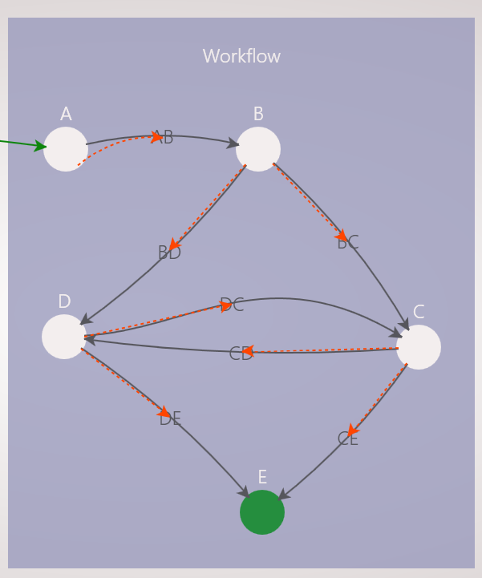
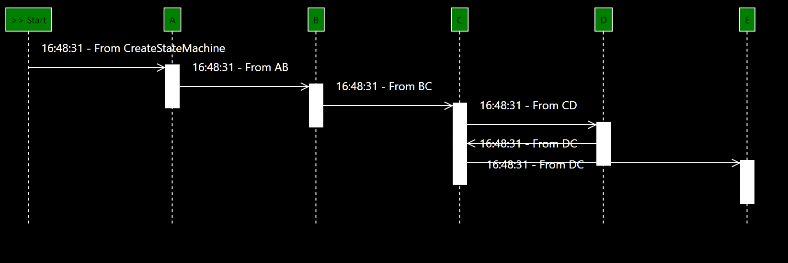

# XComponent Sequence Diagram Control

In this project you will find a generic sequence diagram graphical control which can be reused in any XComponent project.
## Overview

Let's take an example to understand the objective of the Sequence Diagram Control. 
Imagine you have the following state machine:



We can go from state A to state E with several paths:
* Case 1: AB-BC-CE
* Case 2: AB-BD-DE
* Case 3: AB-BC-CD-DE

To ensure the tracability of the state machines developed with XComponent, we wanted to find an appropriate way to visualize the State Machines updates.

As a reminder, every update on a state machine is published on the middleware. So if we listen these notifications, we are able to know the current state of each state machine instances.

Using the XComponent Api, we are able to listen these notifications. So we have created a generic control which is able to display a state diagram, on **any state machine** developped with XComponent.

A simple project is available. It's composed of:
- A XComponent Project (in embedded mode)
- A client app containing the sequence diagram control (double click on sequencediagram.cmd to launch it)

To test the project:
1. execute build.cmd
2. execute sequencediagram.cmd

In the sequence diagram control, click on the "Create State Machine" button.

A state machine is created, and you can observe the states updates with the sequence diagram control:



If you click again on the button, a new state machine is created, and the sequence diagram control is updated:


## Technical overview of the Sequence Diagram Control

The sequence diagram control *SequenceDiagramControl.xaml* is generic. You don't have to modify it. It can be included in any project.

To include this control in your project, you should provide *SequenceDiagramViewModel<>* datacontext to the control.

1. **Include the control, in your xaml**
``` C#
<sequenceDiagramControl:SequenceDiagramControl Grid.Row="1"  DataContext="{Binding WorkflowDiagramViewModel}"></sequenceDiagramControl:SequenceDiagramControl>
```

2. **Create a valid datacontext for the *SequenceDiagramControl*.**

In the sample project, we want to monitor a state machine called *Workflow*. 
The XComponent Api creates an object of type *WorkflowInstance*. 
The type of the data context is : SequenceDiagramViewModel<WorkflowInstance>

3. **Initialize the SequenceDiagramViewModel<WorkflowInstance> object.**

The following code, is in charge of the initialization of the control:

``` C#

// these anynomous method is used to filter the states machines instances
 WorkflowDiagramViewModel.IsValidInstanceFunc += delegate(WorkflowInstance instance)
{
    return true;
};
// these anynomous method is used to enrich the display
WorkflowDiagramViewModel.DisplayedTextFunc += delegate(WorkflowInstance instance)
{
    return instance.PublicMember.LastUpdateDate.ToString("hh:mm:ss:m") + " - From " +
            instance.PublicMember.FromTransition;
};

WorkflowDiagramViewModel.Init(ClientApiWrapper.Instance.Api, Workflow_StateMachine.WorkflowStateEnum.A.ToString(), new Dictionary<string, string>(),
                        Enum.GetNames(typeof (Workflow_StateMachine.WorkflowStateEnum)));
```
The Init() method has the following inputs:
- The Api
- The initial state
- The list of the states

 
## Questions?

If you have any questions about this sample, please [create a Github issue for us](https://github.com/xcomponent/xcomponent/issues)!
