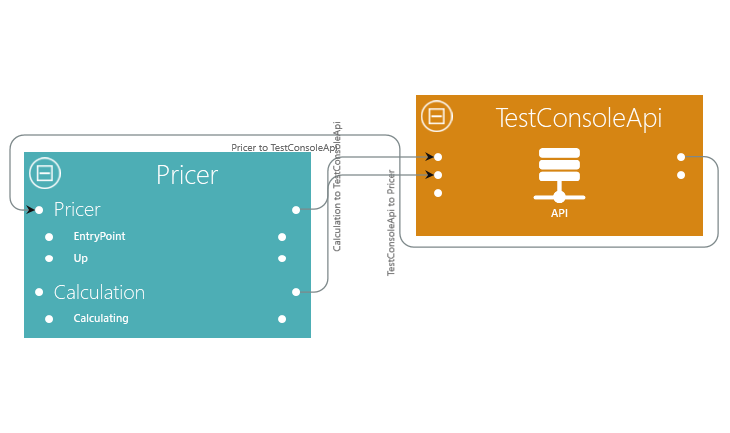
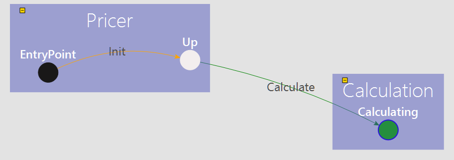
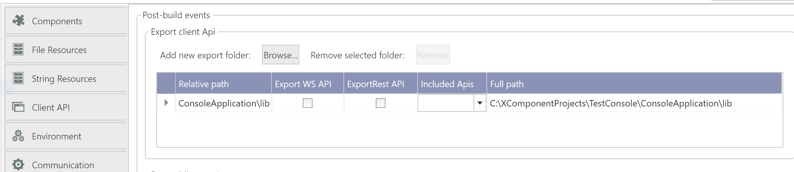
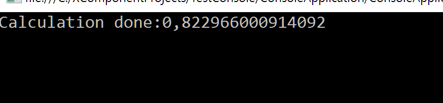

#XComponent Test Plan

We have to create a use case (for each feature we want to test), deploy it (in memory and remote modes) and test it with XCSpy.

## Component Model

* Basic component
* Timeout transitions
* Triggering rules
* Fork transitions
* Triggered methods
* Add new class panel
* Use of senders in triggered methods
* Internal connections
* Triggerable transitions

## Composition

* Links between components and Apis
* Links between components and components
* Create microservice composition

## Configuration

* Add string resources
* Loggers

## Platform

* Test with Websocket bridge
* Export Rest API
* Add external REST microservice
* Add external webservice
* Add external xc microservice

## Clients

The objective of these tests is to generate a `Console application` from a simple XComponent Project.
This test is useful to test both the **client api** and the **console application** generation.

**For these tests, we will use a simple project.**

>Note: The sample project can be downloaded <a href="https://github.com/xcomponent/xcomponent/releases/download/4.5.0-RC119/TestConsole.zip">here</a>

### Sample project
The composition is compound of a component (`Pricer`) and an api (`TestConsoleApi`)



The component simulates a pricer. It answers to calculation requests through with the `Calculate` transition.



### Console app generation

Click on the `Console App` button of the ribbon (in the project tab).
On the popup, you can change the name of the solution. Then, click on `Ok`.

Then, there are several steps:
 1. The project is rebuilt
 2. The Visual Studio solution of the console application is generated
 3. The console application of the visual studio project is automatically open after the build

>Note: You should check (in XCStudio), that the client Api is automatically exported when the project is built.


Go back to the visual studio project of the console application. The code looks like this: 
```cs
static void Main(string[] args)
{
    // Initialize the interfaces
    using(var myTestConsoleApi = new ApiWrapper<TestConsoleApi>())
    {
        ClientApiOptions clientApiOptions = new ClientApiOptions(); //fill this object to override default xcApi parameters

        if(myTestConsoleApi.Init(myTestConsoleApi.Api.DefaultXcApiFileName, clientApiOptions))
        {
            //Your code goes here
        }
        else			
        {
            AnalyseReport(myTestConsoleApi.Report);
        }
    }
}
```
You can improve the test, by using the following code:
```cs
using (var myTestConsoleApi = new ApiWrapper<TestConsoleApi>())
{
    ClientApiOptions clientApiOptions = new ClientApiOptions();
    //fill this object to override default xcApi parameters

    if (myTestConsoleApi.Init(myTestConsoleApi.Api.DefaultXcApiFileName, clientApiOptions))
    {
        AutoResetEvent autoResetEvent = new AutoResetEvent(false);

        myTestConsoleApi.Api.Pricer_Component.Pricer_StateMachine.Up_State.InstanceUpdated +=
            delegate (PricerInstance instance)
            {
                if (instance.StateCode == (int)Pricer_StateMachine.PricerStateEnum.Up)
                {
                    autoResetEvent.Set();
                }
            };

        var ep = myTestConsoleApi.Api.Pricer_Component.GetEntryPoint();
        if (ep.StateCode == (int)Pricer_StateMachine.PricerStateEnum.Up)
        {
            autoResetEvent.Set();
        }
        else
        {
            autoResetEvent.WaitOne();
        }


        myTestConsoleApi.Api.Pricer_Component.Calculation_StateMachine.InstanceUpdated +=
            delegate (CalculationInstance instance)
            {
                Console.WriteLine("Calculation done:" + instance.PublicMember.Value);
                autoResetEvent.Set();
            };
        myTestConsoleApi.Api.Pricer_Component.Pricer_StateMachine.Up_State.Calculate(ep.Context, new Calculate());
        autoResetEvent.WaitOne();
    }

    else
    {
        AnalyseReport(myTestConsoleApi.Report);
    }

    Console.ReadKey();
}

```
### Client api
 The code above is helpful to validate:
 * The behaviour of the client Api 
 * The behaviour of the component.

Start the microservice and then start the console application.
If all works well, you should see the following output:



>Note: This test should be done both in `embedded` and `server` modes. You should not change the code: the code is exactly the same in `server` and `embedded` modes.


We can also check, that the override of client api options works correctly. Using the following code:
```cs
 ClientApiOptions clientApiOptions = new ClientApiOptions();
 clientApiOptions.Host = "dummyhost";
```
If we start the client api again, the `Init` should failed because we have set a wrong host for the `RabbitMq` bus.


## Others

* Mono
* Snapshots

## Documentation

Generate project documentation
